# msec服务开发详解（cpp）

## 1、示例的场景描述

这里我们会以一个实际的例子来说明如何基于msec开发一个服务。

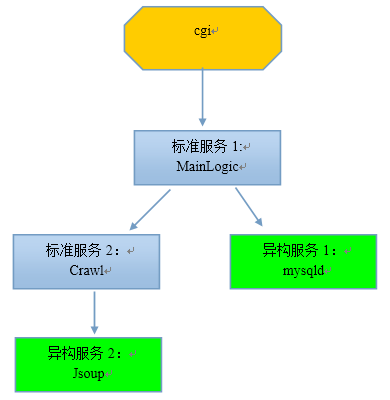

如上图所示，

1.  cgi访问MainLogic，请求拉取英语听力mp3列表

2.  MainLogic收到请求后，转而请求Crawl

3.  Crawl也没有mp3列表，转而请求异构服务Jsoup

4.  Jsoup是一个抓去网上MP3英语听力文件的服务，逐级把mp3列表返回给Crawl和MainLogic

5.  MainLogic收到mp3列表后，将列表写入mysqld，并返回给客户端

**这个例子比较典型，包括好几种远程调用场景：**

1.  场景一：其他模块调用标准服务（cgi调用MainLogic的GetTitles接口和GetUrlByTitle接口）

2.  场景二：标准服务A调用标准服务B（MainLogic调用Crawl的GetMP3List接口）

3.  场景三：标准服务A调用异构服务B，异构服务B提供接口协议文档的形式（Crawl调用Jsoup）

4.  场景四：标准服务A调用异构服务B，异构服务B提供接口API的形式（MainLogic调用mysqld）

5.  场景五：其实还有一种情况，A部门部署了一个msec，B部门也部署了一个msec，A部门的标准服务a调用B部门的标准服务b

## 具体步骤

### Step1：在msec console上添加上述服务

如下所示：

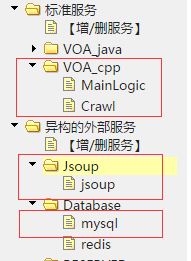

### Step2：配置标准服务

添加MainLogic服务的部署IP：

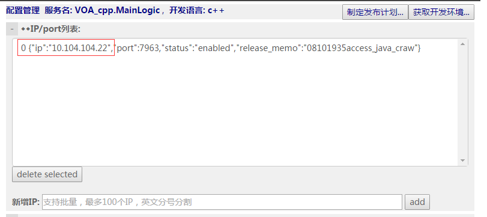

添加MainLogic服务的配置文件,用默认配置文件即可：

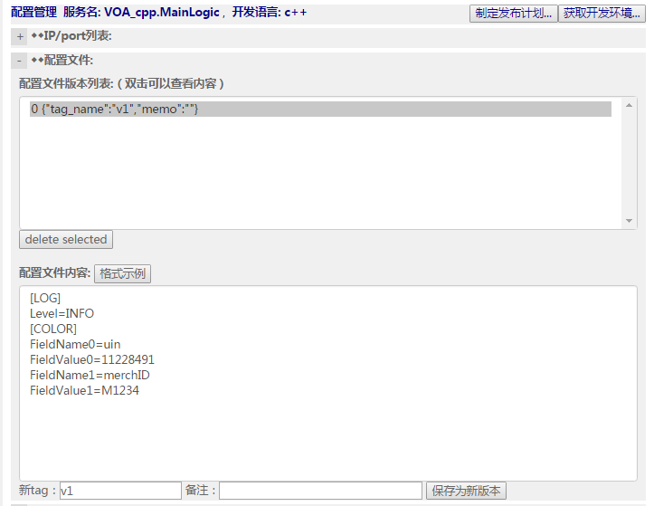

添加MainLogic服务的接口定义文件（protocol buffer方式）：

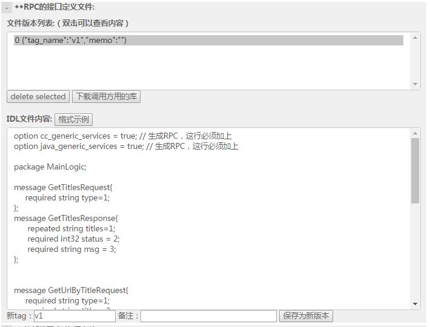

如果用到其他库文件，例如使用了加密算法，那么可能需要引入openssl库，那就配置到外部库中

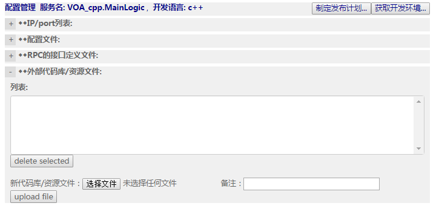

类似的，也配置好标准服务Crawl。

这里给一下接口定义文件的文本，方便大家拷贝试做

MainLogic的接口定义文件：
```protobuf
option cc_generic_services = true;

option java_generic_services = true;

package MainLogic;

message GetTitlesRequest{

required string type=1;

};

message GetTitlesResponse{

repeated string titles=1;

required int32 status = 2;

required string msg = 3;

};

message GetUrlByTitleRequest{

required string type=1;

required string title = 2;

};

message GetUrlByTitleResponse{

optional string url=1;

required int32 status = 2;

required string msg = 3;

};

message DownloadMP3Request

{

required string type=1;

required string title = 2;

}

message DownloadMP3Response

{

required int32 status = 1;

required string msg=2;

optional int32 file_len=3;

optional bytes file_content=4;

}

service MainLogicService{

rpc GetTitles(GetTitlesRequest) returns (GetTitlesResponse);

rpc GetUrlByTitle(GetUrlByTitleRequest) returns (GetUrlByTitleResponse);

rpc DownloadMP3(DownloadMP3Request) returns (DownloadMP3Response);

}
```

Crawl的接口定义文件如下：
```protobuf

option cc_generic_services = true;

option java_generic_services = true;

package crawl;

message OneMP3

{

required string title = 1;

required string url = 2;

}

message GetMP3ListRequest{

required string type=1;

};

message GetMP3ListResponse{

repeated OneMP3 mp3s=1;

required int32 status=2;

required string msg=3;

};

service CrawlService {

rpc GetMP3List(GetMP3ListRequest) returns (GetMP3ListResponse);

}
```

### Step3：开发标准服务MainLogic

点击MainLogic 服务的“获取开发环境”的按钮，下载开发包，在开发机上展开


因为MainLogic服务访问Crawl，所以还需要用到Crawl的接口API，如何获得呢？

在Crawl的配置页面那里，下载调用方用到的库：

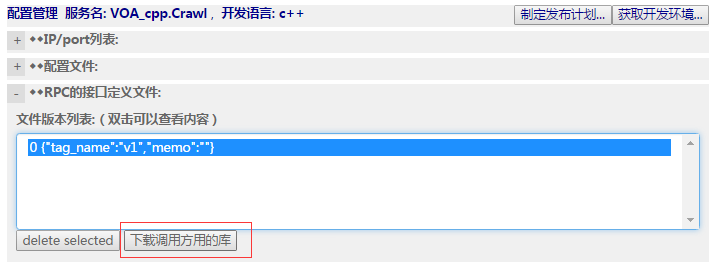

下载后可以看到里面有两个c++代码文件和一些java代码文件，其中c++代码文件是我们需要用到的：


将这两个文件放到MainLogic服务的开发机的MainLogic/MainLogic_server目录下，我们就可以在代码里引用这两个文件里的相关函数和变量了，从而调用Crawl服务提供的接口。

在开发机上，进入MainLogic_server目录，修改msg_MainLogic_impl.cpp，增加业务代码。

其中值得关注的是如何访问Crawl服务，也就是场景二：标准服务调用标准服务：

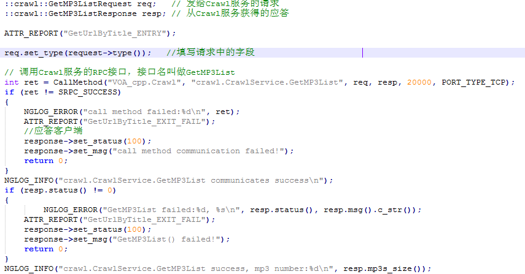

另一个值得关注的是如何访问mysql服务，也就是场景四：标准服务调用异构服务且异构服务提供接口API

首先配置异构服务mysql的IP列表，并通过扩缩容操作，将新加入的IP扩容到负载均衡系统里，这样就能被其他服务访问到。点击右上角的扩缩容按钮。该IP的状态由disabled变成enabled


在MainLogic的代码里访问这个异构服务：

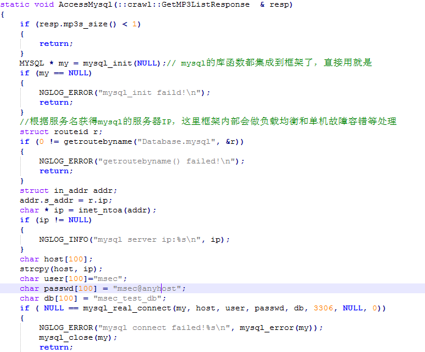

由于mysql服务不是框架提供的标准服务，所以我们无法像前面那样使用CallMethod直接进行rpc。这里，getroutebyname函数是重点，通过它可以使用msec的名字查找服务。

详细的函数说明如下：
```cpp
typedef enum {

NLB_PORT_TYPE_UDP = 1,

NLB_PORT_TYPE_TCP = 2,

NLB_PORT_TYPE_ALL = 3,

}NLB_PORT_TYPE;

/* 单条路由信息 */

struct routeid

{

uint32_t ip; // IPV4地址 : 网络字节序

uint16_t port; // 端口 : 本机字节序

NLB_PORT_TYPE type; // 端口类型

};

/**

* @brief 通过业务名获取路由信息

* @para name: 输入参数，业务名字符串 "Login.ptlogin"

* @ route: 输出参数，路由信息(ip地址，端口，端口类型)

* @return 0: 成功 others: 失败

*/

int32_t getroutebyname(const char *name, struct routeid *route);

/**

* @brief 更新路由统计数据

* @info 每次收发结束后，需要将成功与否、时延数据更新到统计数据

* @para name: 输入参数，业务名字符串 "Login.ptlogin"

* ip: 输入参数，IPV4地址，网络序

* failed:输入参数，>1:失败次数 0->成功

* cost: 输入参数，时延

*/

int32_t updateroute(const char *name, uint32_t ip, int32_t failed, int32_t cost);
```

getroutebyname通过业务名获取路由信息；updateroute更新路由统计信息，用于lb做回包统计。如果不需要回包统计做动态路由，可以不用调用updateroute。

为了方便直接试用，这里给出了代码：[msg_MainLogic_impl.cpp](examples/dev_cpp/msg_MainLogic_impl.cpp)。

如果用到了外部库，如前面提到的openssl库，那么这个库会被放置在MainLogic/lib目录下。

### Step4:编译MainLogic服务

在MainLogic_server目录下执行make，编译出service_MainLogic.so这样一个业务插件。将该业务插件上传到msec
console：

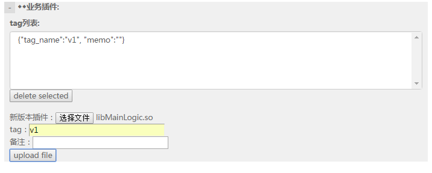

### Step5：开发标准服务Crawl

类似MainLogic，也是从msec
console下载crawl服务的开发环境，并在开发机上展开，修改msg_crawl_impl.cpp文件，增加业务逻辑。

Crawl服务的业务逻辑比较简单，访问Jsoup这个异构服务，拉取一个英语mp3文件的(文件标题，
文件url)的列表。

这里值得特别注意的是：这是场景三：标准服务访问一个异构服务，该异构服务提供了接口协议文档。

首先，配置Jsoup的IP并扩容到负载均衡管理系统里：

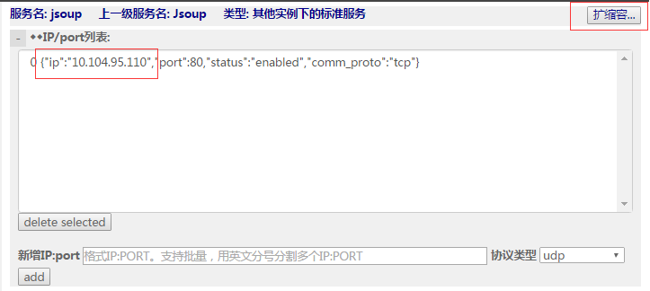

然后就写代码如下：

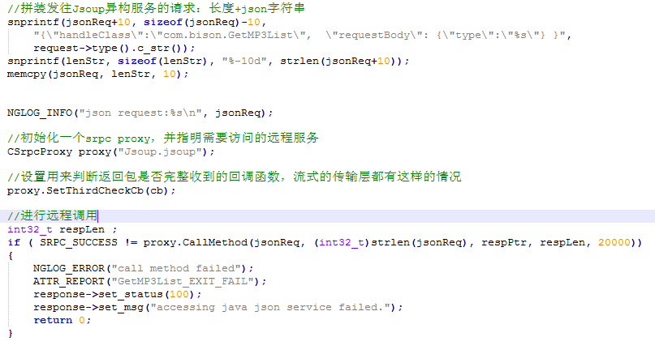

可以看出这里的关键是CSrpcProxy类和用来判断应答报文是否完整的回调函数cb：

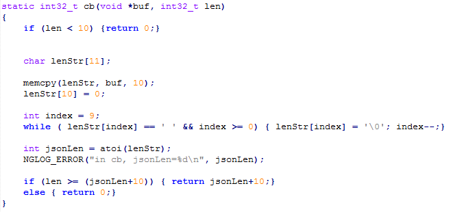

详细的说明如下：

```cpp
/**

* @brief 第三方法调用接口

* @info 第三方协议调用接口

* @param request 请求报文buffer

* req_len 请求报文长度

* response 回复报文buffer，接口malloc申请，调用者需要free释放

* rsp_len 回复报文长度

* timeout 超时时间

* @return SRPC_SUCCESS 成功

* 其它 失败

*/

int32_t CSrpcProxy：：CallMethod(const char *request, int32_t req_len, char* &response, int32_t &rsp_len, int32_t timeout);

/**

* @brief 检测报文是否接收完整的回调函数定义

* @param buf 报文保存缓冲区

* @param len 已经接收的长度

* @return >0 实际的报文长度; 0 还需要等待接收; <0 报文异常

*/

typedef int32_t (*CheckPkgLenFunc)(void *buf, int32_t len);

/**

* @brief 设置检查报文长度回调函数

* @info 用于第三方协议检查报文完整性

*/

void SetThirdCheckCb(CheckPkgLenFunc cb);
```

伪代码示例如下：

```cpp
// 1. 初始化代理

CSrpcProxy proxy("127.0.0.1:6688@udp");

// 如果异构服务已经录入webconsole，也可采用如下方式

CSrpcProxy proxy("Login.ptlogin"); // 参数为webconsole登记的业务名

proxy.SetThirdCheckCb(cb);// cb为业务自己实现的检查报文合法性的回调函数

// 2. 异构业务的打包函数

PackRequest(send_buf, send_len, request)

// 3. 调用微线程接口收发包

proxy.CallMethod(send_buf, send_len, recv_buf, recv_len, timeout)

// 4. 异构业务的解包函数

UnpackResponse(recv_buf, recv_len, response)
```

为了方便拷贝试做，这里给出了代码：[msg_crawl_impl.cpp](examples/dev_cpp/msg_crawl_impl.cpp)

另外还有两个用到解析json字符串的c++代码，请放到msg_crawl_impl.cpp相同的目录下即可：
[frozen.h](https://github.com/cesanta/frozen/blob/master/frozen.h)
[frozen.c](https://github.com/cesanta/frozen/blob/master/frozen.c)

### Step6：cgi访问MainLogic标准服务

首先从MainLogic的配置页面下载调用方用的库：

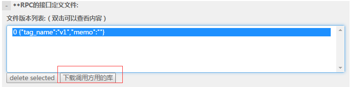

这就是场景一：外部模块调用标准服务。

下载的文件，解开后，对于c++开发者而言需要用到这些头文件和库：

Step1： 将3rd_API/dev_cpp目录下的include和lib，拷贝到自己的工程目录下备用

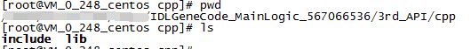

Step2：接口定义文件经过protoc编译生成的两个文件，也拷贝到自己的工程目录下备用


Step3：在cgi_main.cpp文件里写调用MainLogic服务的代码，写个makefile来编译这个工程：

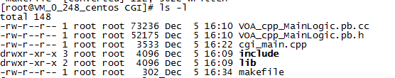

这里讲解一下cgi_main.cpp的代码：

C++主要是用到CSrpcProxy类的Serialize()、DeSerialize()、
CheckPkgLen()三个函数。

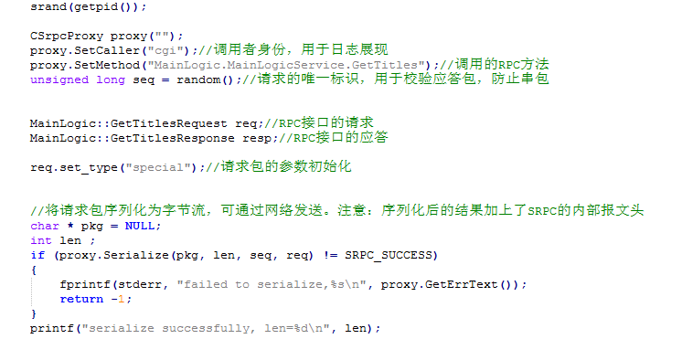

收应答包的时候，CheckPkgLen用于流式传输层的报文完整性判断：


收到完整应答报文后，使用DeSerialize函数解析，然后就可以访问业务层数据了

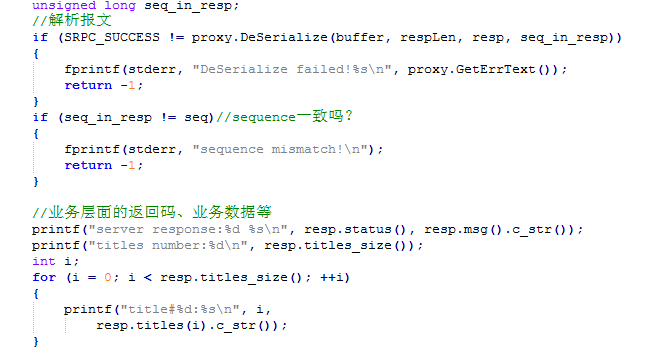

为了方便拷贝试做，这里提供了完整的代码：
[cgi_main.cpp](examples/dev_cpp/cgi_main.cpp)
[makefile](examples/dev_cpp/makefile)

需要注意的是：include和lib目录已经自带了google protobuf的头文件和库，不要被你的编译机已经安装的protobuf给干扰了

**专门说一下场景五：不同msec实例之间的标准服务的相互调用**

假设msec_A下的标准服务a调用msec_B下的标准服务b，那么

1.  在msec_A的console管理页面里配置一个异构服务，假设叫msec_B.b，将IP配置进去，并扩容到负载均衡系统里

2.  找msec_B下载调用方用的库，获得b的接口调用API

3.  就像场景二一样的编码，用CallMethod发起对msec_B.b 这个服务的访问即可

### Step7：发布标准服务

首先，确保要发布的业务运营机环境已经安装了毫秒的agent并启动ok，详细见《msec是什么.docx》里的第一步：机器准备环节

然后点击“制定发布计划”按钮，一步一步选择要发布的目标IP、业务插件等等


然后在菜单“运维-&gt;发布”里查找到刚才建立的发布计划，如果状态显示为create
successfully，就可以点击“详细”进去执行发布

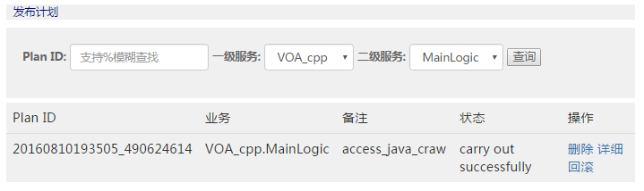

发布成功的话，应该能看到srpc进程启动了，四个agent进程也在运行

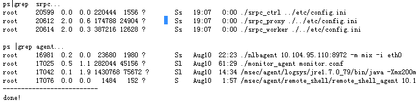

完成发布后，如果业务服务起IP的状态还是disabled，那意味着没有进入负载均衡系统对外服务，这个时候通过菜单“运维-&gt;容量”查询并做扩缩容操作，成功后，对应IP状态变为enabled

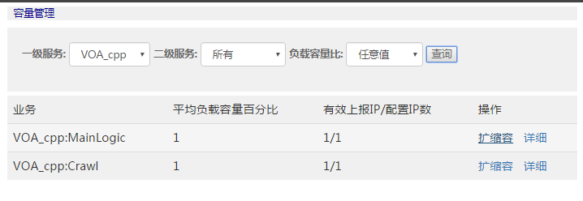

类似的，标准服务Crawl也是如此发布并扩容

3、关于微线程使用的注意事项
---------------------------

msec提供的c++框架，在应用层实现了协程，我们称为微线程。简单的说原理就是：在一个进程内，有成百上千个执行流（就叫微线程），他们共享进程的资源，但是有各自的栈空间、寄存器和当前执行指令位置（可以理解为EIP寄存器）。

每个微线程串行的处理收到的网络请求包，任一时刻只有一个微线程在执行，执行到网络IO的代码的时候，需要等待远程模块的应答，框架就会记录该微线程的上下文状态，并切换去执行其他微线程，直到有应答到来或者超时，再切回之前中断的微线程继续往下执行。

所以使用msec的c++框架需要注意：

1.  不要在栈上开辟太大的变量，栈最大默认128k

2.  全局变量或者局部的静态变量可能会被其他微线程修改

3.  mysql/redis的同步API，会导致当前进程阻塞在网络IO那里，所有微线程都得不到执行，极大的影响到服务吞吐量。为此我们修改了mysql/redis
    API的实现，集成到框架内部，在网络IO的时候，会进行微线程的切换，避免了上述问题。所以要使用框架提供的mysql
    / redis API。


