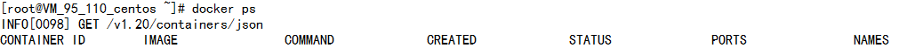
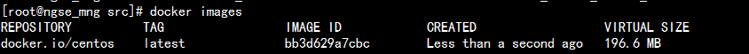
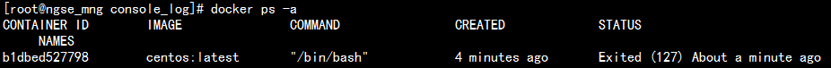
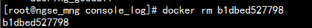
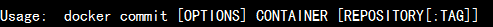
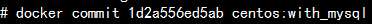
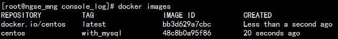

# Docker入门好简单

# 安装docker

## 先在母机上安装docker，以centos为例：

```bash
yum install docker
```

一般情况会直接成功，显示Complete!

但是腾讯云的centos7版本下会报错，需要更新一下lvm2，所以先执行：

```bash
yum install lvm2**
```

## 启动docker服务程序

```bash
docker daemon &
```

或者

```bash
service docker start
```

Docker初始化会需要一段时间（10min？），并且机器响应会很慢，要耐心等。过一会，就可以用`docker ps`看看是不是正常返回了：

```bash
docker ps
```



# 以centos为例来使用docker

从仓库拉一个centos 的镜像（很重要的概念，类似一个可执行文件）下来：

```bash
docker pull centos
```

有时候会失败，据说是因为防火墙的原因。多试几次。因为文件比较大， 时间会长一点。

也可以考虑从国内的仓库拉取：

```bash
docker pull daocloud.io/centos
```

成功拉下来后，用images命令可以查看到：



用run命令执行它：

```bash
docker run –it centos:latest /bin/bash
```

执行后，你的终端就是连接的docker里的centos虚拟机
！在里面可以如操作普通centos一般

另外起一个securecrt连接到母机，可以用ps命令查看docker容器（容器是很重要的概念，可以认为是一个执行中的虚拟机实例，类似进程，另一个概念是镜像，类似可执行文件）


如果在刚才启动的centos虚拟机里执行exit命令，那么docker ps命令就看不到这个容器了，因为它停止执行了，用`docker ps -a`才能看到：



用**docker rm**可以删除这些已经停止了的容器，可以类比为僵尸进程吧



如果不希望exit退出但是又想解脱那个终端怎么办呢？在终端里按`CTRL-p CTRL-q`

如果我又想让当前终端“连接”到这个容器怎么办呢，用`docker attach`命令


如果我想在虚拟机里面装个自己的应用程序或者装个mysql，并且希望下次启动虚拟机这些程序还在，怎么弄呢，那就装好这些程序后，用`docker commit`命令提交为一个新的镜像



例如



你看，多了一个我自己的镜像，用run命令启动它，里面会有mysql



如果希望这个镜像在其他母机上执行起来，可以使用export命令导出为.tar文件，在其他机器上用import命令导入镜像，然后执行。Docker的思想本来就是制作-移动-运行


## 授之以渔

`docker --help`可以查看有哪些子命令

`docker 子命令 --help`可以查看该子命令有哪些选项

最为重要的就是run子命令了

**容器里的用户数据如何落地到磁盘**

容器执行后，里面的系统是一个动态运营的系统，会不断的产生用户数据、日志、增删mysql记录....， 那么这个怎么保存起来防止掉电丢失呢？
未必不断的commit到镜像里去吗？

当然不是，这就要用到数据卷。**执行子命令run的时候，用-v参数指定：将母机上的一个目录挂载到容器的某个目录上，那么在容器里发生的所有修改，都体现在母机的磁盘(目录)里了**。这样就将静态的镜像文件和动态的用户数据分离开来了，好处显而易见。

例如：


