# msec服务开发详解（java）

## 1、示例的场景描述

这里我们会以一个实际的例子来说明如何基于msec开发一个服务。

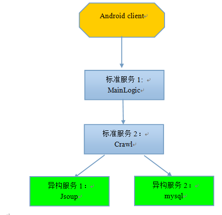

如上图所示，

1.  android客户端访问MainLogic，请求拉取英语听力mp3列表。如果希望通过C/C++（如cgi）访问MainLogic，请参考msec服务开发详解(cpp)文档相关章节。

2.  MainLogic收到请求后，转而请求Crawl

3.  Crawl也没有mp3列表，转而请求异构服务Jsoup

4.  Jsoup是一个抓去网上MP3英语听力文件的服务，逐级把mp3列表返回给Crawl和MainLogic

5.  Crawl收到列表后将列表写入mysql，并返回给MainLogic

6.  MainLogic收到mp3列表后，并返回给客户端

**这个例子比较典型，包括好几种远程调用场景：**

1.  场景一：其他模块调用标准服务（android客户端调用MainLogic的GetTitles接口和GetUrlByTitle接口）

2.  场景二：标准服务A调用标准服务B（MainLogic调用Crawl的GetMP3List接口）

3.  场景三：标准服务A调用异构服务B，异构服务B提供接口协议文档的形式（Crawl调用Jsoup）

4.  场景四：标准服务A调用异构服务B，异构服务B提供接口API的形式（Crawl调用mysqld）

5.  场景五：其实还有一种情况，A部门部署了一个msec，B部门也部署了一个msec，A部门的标准服务a调用B部门的标准服务b

##具体步骤

### Step1：在msec console上添加上述服务

如下所示：

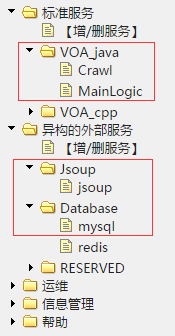

### Step2：配置标准服务

添加MainLogic服务的部署IP：

添加MainLogic服务的配置文件,用默认配置文件即可：

添加MainLogic服务的接口定义文件（protocol buffer方式）：

如果用到其他库文件，例如使用了redis服务，那么可能需要引入jedis库，那就配置到外部库中

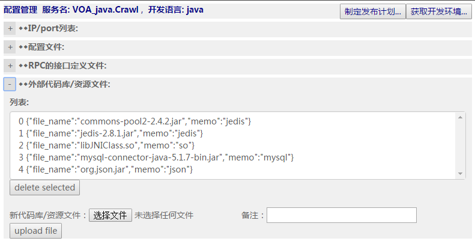

类似的，也配置好标准服务Crawl。

这里给一下接口定义文件的文本，方便大家拷贝试做

**MainLogic的接口定义文件：**

option cc_generic_services = true; // 生成RPC，这行必须加上

option java_generic_services = true; // 生成RPC，这行必须加上

package MainLogic;

message GetTitlesRequest{

required string type=1;

};

message GetTitlesResponse{

repeated string titles=1;

required int32 status = 2;

required string msg = 3;

};

message GetUrlByTitleRequest{

required string type=1;

required string title = 2;

};

message GetUrlByTitleResponse{

optional string url=1;

required int32 status = 2;

required string msg = 3;

};

message DownloadMP3Request

{

required string type=1;

required string title = 2;

}

message DownloadMP3Response

{

required int32 status = 1;

required string msg=2;

optional int32 file_len=3;

optional bytes file_content=4;

}

service MainLogicService{

rpc GetTitles(GetTitlesRequest) returns (GetTitlesResponse);

rpc GetUrlByTitle(GetUrlByTitleRequest) returns (GetUrlByTitleResponse);

rpc DownloadMP3(DownloadMP3Request) returns (DownloadMP3Response);

}

**Crawl的接口定义文件如下：**

option cc_generic_services = true; // 生成RPC，这行必须加上

option java_generic_services = true; // 生成RPC，这行必须加上

package crawl;

message OneMP3

{

required string title = 1;

required string url = 2;

}

message GetMP3ListRequest{

required string type=1; //标准英语还是慢速英语

};

message GetMP3ListResponse{

repeated OneMP3 mp3s=1;

required int32 status=2;

required string msg=3;

};

service CrawlService {

rpc GetMP3List(GetMP3ListRequest) returns (GetMP3ListResponse);

}

### Step3：开发标准服务MainLogic

**1.  点击MainLogic服务的“获取开发环境”的按钮，下载开发包，在开发机上展开**
    

**2.  进入到开发包展开的目录，应该能看到pom.xml文件，根据版本执行下面两行命令中的一行**

chmod a+x lib/protoc; mvn compile; mvn package    #用于1.0版本

mvn compile; mvn package    #用于2.0及以后版本
   
如果没有问题，显示成功编译，并生成

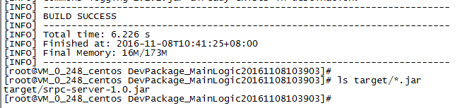

**3.  修改ServiceImpl.java，增加业务代码。**

因为MainLogic服务访问Crawl，所以还需要用到Crawl的接口API，如何获得呢？

在Crawl的配置页面那里，下载调用方用到的库：

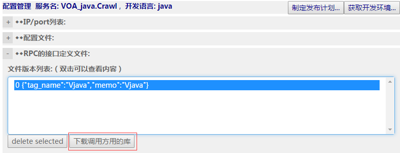

下载后可以看到里面有个crawl文件夹，crawl文件夹内的java代码文件是我们需要用到的：

VOAJavaCrawl.java（文件名可能因为版本不同有所调整）。

将crawl文件夹整个都拷贝到MainLogic业务模块的开发环境的src/main/java目录下，我们就可以在代码里引用这两个文件里的相关函数和变量了，从而调用Crawl服务提供的接口：

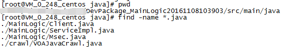

这里值得关注的是如何访问Crawl服务，也就是场景二：标准服务调用标准服务.

**4.  编写业务逻辑相关代码**

找到ServiceImpl.java文件，在注释

//Add your code here

后面增加业务逻辑相关的代码

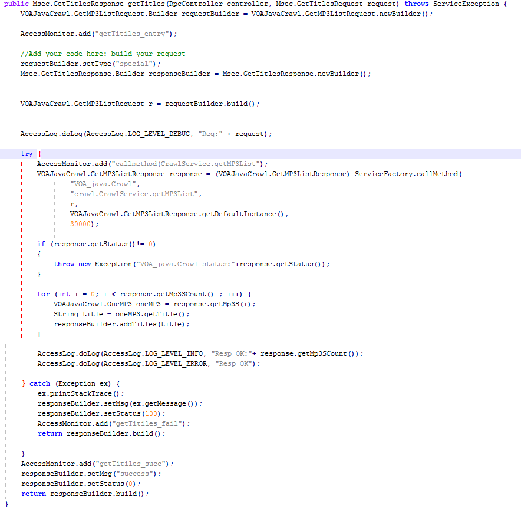

为了方便直接拷贝试用，这里给出了ServiceImpl.java文件：

[ServiceImpl.java](examples/dev_java/MainLogic/ServiceImpl.java)

### Step4：编译MainLogic服务

重新在pom.xml文件所在的目录执行

mvn package

生成srpc-server-1.0.jar这样一个业务插件。将该业务插件上传到msec console：

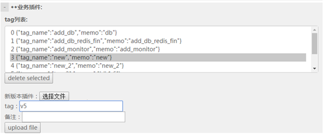

### Step5：开发标准服务Crawl

类似MainLogic，也是从msec console下载crawl服务的开发环境，并在开发机上展开，修改ServiceImpl.java文件，增加业务逻辑。

Crawl服务的业务逻辑比较简单，访问Jsoup这个异构服务，拉取一个英语mp3文件的(文件标题，
文件url)的列表。这里你可以根据自己的具体情况，来访问一个存在的服务，例如访问www.baidu.com首页的http接口拉取一个html页面。

这里值得特别注意的是：这是场景三：标准服务访问一个异构服务，该异构服务提供了接口协议文档。

首先，配置Jsoup的IP并扩容到负载均衡管理系统里：

然后就写代码如下：

	try {
		//通过路由服务获取一个IP地址
		lb.getroutebyname("Jsoup.jsoup", r);
		if (r.getComm_type() != Route.COMM_TYPE.COMM_TYPE_TCP &&
				r.getComm_type() != Route.COMM_TYPE.COMM_TYPE_ALL) { //确认路由类型
			builder.setStatus(100);
			builder.setMsg("tcp is not supported by jsoup");
			return builder.build();
		}

		// connect server
		socket.setSoTimeout(20000);//20 seconds
		socket.connect(new InetSocketAddress(r.getIp(), r.getPort()), 2000);

		// send request bytes
		socket.getOutputStream().write(lenStr.getBytes(Charset.forName("utf8")));
		socket.getOutputStream().write(jsonStr.getBytes(Charset.forName("utf8")));

		// recv response bytes
		byte[] buf = new byte[102400];
		int max = 10;
		int total = 0;
		while (total < max)
		{
			int len = socket.getInputStream().read(buf, total, max-total);
			if (len <= 0) {
				socket.close();
				throw new Exception("recv json length failed");
			}
			total += len;
		}
		max = new Integer(new String(buf, 0, 10, Charset.forName("utf8")).trim()).intValue();
		total = 0;
		while (total < max)
		{
			int len = socket.getInputStream().read(buf, total, max-total);
			if (len <= 0)
			{
				socket.close();
				throw new Exception("recv json bytes failed");
			}
			total += len;
		}
		// 解回包等后续逻辑
	}
	catch (Exception e) {
		e.printStackTrace();
	}

这里的关键就是通过路由服务获取业务对应的ip，然后通过java自有的网络调用函数收发获取业务数据，最后完成解包。

另一个值得关注的是如何访问mysql服务，也就是场景四：标准服务调用异构服务

首先配置异构服务mysql的IP列表，并通过扩缩容操作，将新加入的IP扩容到负载均衡系统里，这样就能被其他服务访问到。点击右上角的扩缩容按钮。该IP的状态由disabled变成enabled

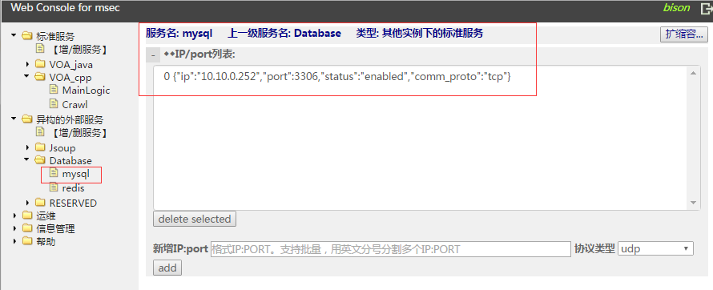

然后写代码如下，其中DBUtil类简单封装了Mysql的操作。

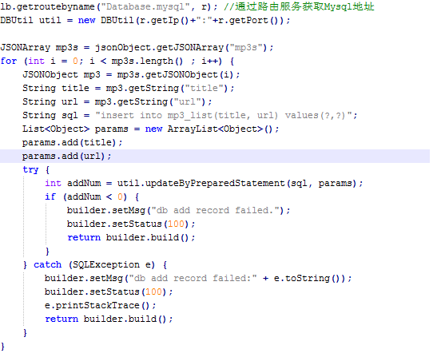

关于通过lb路由服务获取业务ip信息，主要的api如下：

getroutebyname通过业务名获取路由信息；updateroute更新路由统计信息，用于lb做回包统计。如果不需要回包统计做动态路由，可以不用调用updateroute。

另外业务代码里用到了org.json.jar这个库来解析json字符串、mysql-connector.jar来访问mysql数据库，注意配置在外部代码库中，并在编译的时候注意配置到pom.xml文件（我们假定你是一个熟悉mvn的攻城狮）里。

你也可以根据实际情况删减代码，不访问mysql，使得本例子更简单。我们在这里加上mysql访问的目的是为了更全面的演示各种场景。

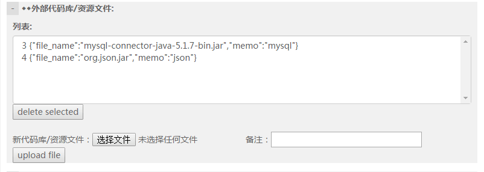

为了方便拷贝试做，这里给出DBUtil.java和ServiceImpl.java文件的完整版本：

[DBUtil.java](examples/dev_java/Crawl/DBUtil.java)

[ServiceImpl.java](examples/dev_java/Crawl/ServiceImpl.java)

### Step6：android客户端访问MainLogic标准服务

首先从MainLogic的配置页面下载调用方用的库：

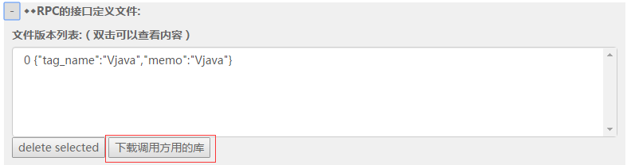

下载下来后，里面包含了访问该pb接口的客户端API，支持java和cpp等语言。因为是android开发，我们需要用到下载文件里的VOAJavaMainLogic.java和3rd_API.zip文件里java目录下的jar包

在android app的代码里，通过上述API来访问MainLogic服务：

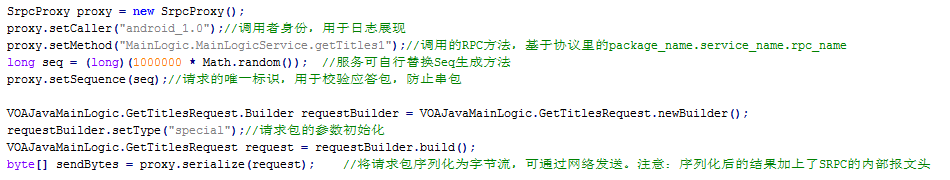

发出请求后，流式传输层接收应答的处理：

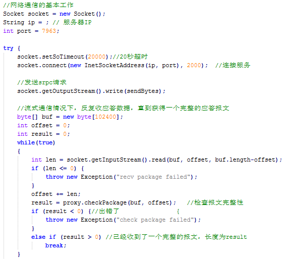

收到应答后，拆解出rpc隐含的头部、包体，进行解析

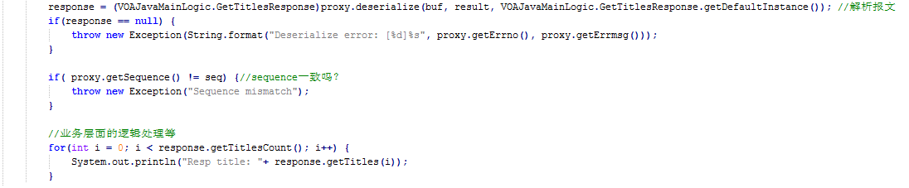

这里主要关注SRpcPrxy类下的三个接口：

byte\[\] serialize(MessageLite request) // 用于组包

checkPackage(byte \[\] data, int length) //用于判断包的完整性

MessageLite deserialize(byte \[\] data, int length, MessageLite
responseInstance) //用于解包

为了方便拷贝试做，这里给出客户端VOAClient.java文件的完整版本：

[VOAClient.java](examples/dev_java/Android/VOAClient.java)

注意：这就是场景一：外部模块调用标准服务。

另外专门说一下场景五：不同msec实例之间的标准服务的相互调用

假设msec_A下的标准服务a调用msec_B下的标准服务b，那么

1.  在msec\_A的console管理页面里配置一个异构服务，假设叫msec_B.b，将IP配置进去，并扩容到负载均衡系统里

2.  找msec\_B下载调用方用的库，获得b的接口调用API

3.  就像场景二(Step 3)一样的编码，用CallMethod发起对msec_B.b 这个服务的访问即可

### Step7：发布标准服务

首先，确保要发布的业务运营机环境准备好了：

1.  已经安装好了jre
    (version &gt;=1.6)，且java这个命令在PATH环境变量里能找到

2.  已经安装了毫秒的agent并启动ok，详细见《msec是什么.docx》里的第一步：机器准备环节

上面1和2的顺序不能错，即先确保任意目录下敲java命令可执行，然后再启动agent，这样发布才不会出错，因为agent会调用java这个命令来启动逻辑层框架。

点击“制定发布计划”按钮，一步一步选择要发布的目标IP、业务插件等等

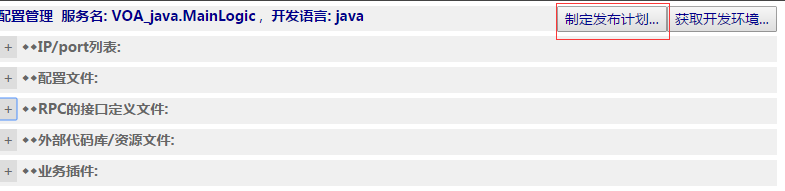

然后在菜单“运维-&gt;发布”里查找到刚才建立的发布计划，如果状态显示为create
successfully，就可以点击“详细”进去执行发布

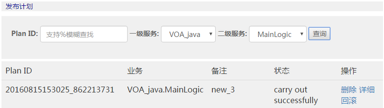

发布成功的话，应该能看到srpc进程启动了，四个agent进程也在运行

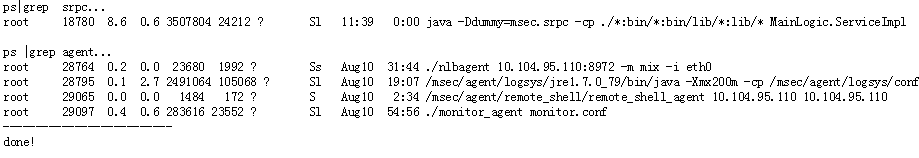

完成发布后，如果业务服务起IP的状态还是disabled，那意味着没有进入负载均衡系统对外服务，这个时候通过菜单“运维-&gt;容量”查询并做扩缩容操作，成功后，对应IP状态变为enabled

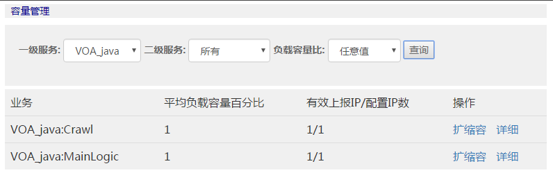

类似的，标准服务Crawl也是如此发布并扩容。
