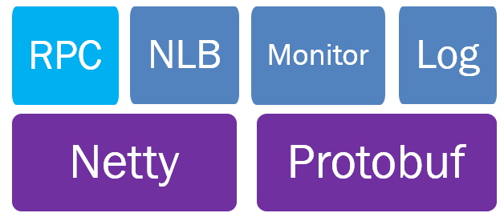
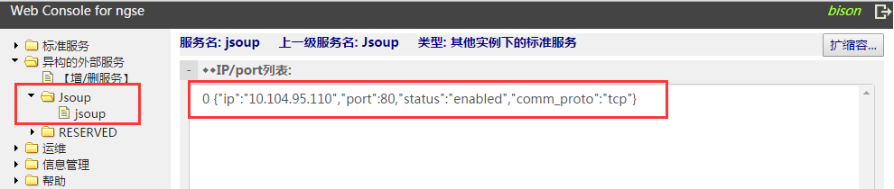

# SRPC Java开发手册

MSEC是一个开发+运营解决方案，不只是一个开发框架，适用于在廉价机器组成的集群上开发和运营分布式的互联网后台服务。MSEC的创作冲动和构建经验，来自QQ后台团队近10年的运营思考。

本文主要介绍如何使用MSEC的SRPC Java开发业务代码。

# 整体设计

SRPC
Java是基于Netty，protobuf实现的RPC服务器框架，框架与MSEC系统相结合，内置对服务发现(NLB)、负载均衡(NLB)、监控(Monitor)、日志(Log)的支持。

Netty是一个高性能、异步事件驱动的NIO框架，在此不再赘述，详情参考http://netty.io/。



SRPC Java主要功能如下：

- **RPC**<br/>远程RPC接口，简化模块间调用
- **协议**<br/>采用google的protobuf协议做为标准协议，自动生成代码，使用简单
- **名字服务**<br/>采用MSEC内部使用的NLB做名字服务，以JNI形式嵌入框架, 通过mmap与本机的NLB Agent通信
- **负载均衡**<br/>采用MSEC内部使用的NLB做负载均衡, 以JNI形式嵌入框架, 通过mmap与本机的NLB Agent通信
- **服务监控**<br/>采用MSEC内部使用的打点监控系统Monitor, 以JNI形式嵌入框架, 通过mmap与本机的Monitor Agent通信
- **日志**<br/>支持本地日志和远程日志，远程日志采用MSEC内部使用的日志系统，支持染色, 以JNI形式嵌入框架, 通过socket与本机的Logsys Agent通信

# SRPC编码

## 协议定义

SRPC的协议完全使用google protobuf，
协议的定义实际上就是一个proto文件。在msec中，开发同学只需要在页面上定义好协议即可。

```protobuf
// 包名, 建议小写 linux 命令风格: echo
//重要：产生的java代码目录名和包名是一致的
package echo;

// 请求消息定义
message EchoRequest
{
    optional string message = 1;
}

// 应答消息定义
message EchoResponse
{
    optional string message = 1;
}

// 定义服务, 建议首字符大写，只允许定义一个
service EchoService
{
    // 定义方法, 可以多个
    rpc Echo(EchoRequest) returns (EchoResponse);
}

option java_generic_services = true; // 生成RPC，这行必须加上
```

## 生成代码

SRPC通过开发者定义的协议格式，可以自动生成对应的代码，业务开发者只需要关注业务的逻辑即可。在msec中，自动生成的代码通过页面完成。以上文中的echo为例，生成后的代码下载下来的目录如下：

```
 |-- bin
 | |-- entry.sh //jar包执行入口
 | |-- lib
 | |-- srpc.sh //服务启动停止脚本
 | `-- test_client.sh
 |-- etc //配置文件
 | |-- config.ini
 | `-- log4j.properties
 |-- lib //依赖的jar包
 | |-- netty-3.2.10.Final.jar
 | |-- protobuf-java-2.5.0.jar
 | |-- ...
 | `-- protoc
 |-- pom.xml //Maven pom文件
 |-- pom_offline.xml //无法访问网络时，用该POM文件进行项目构建
 |-- src
 | |-- main
 | | |-- java
 | | | |-- api //引入负载均衡、监控、日志的支持
 | | | |-- org
 | | | | `-- msec //框架的主体代码
 | | | |-- sample //服务端包名, 与proto文件的package名对应
 | | | | |-- Client.java //客户端代码
 | | | | `-- ServiceImpl.java //服务端代码
 | | | `-- srpc
 | | | `-- Head.java
 | | `-- resources
 | | |-- META-INF
 | | | `-- log4j.properties
 | | `-- sofiles //JNI外部库：负载均衡、监控、日志
 | | |-- libjni_lb.so
 | | |-- libjni_log.so
 | | `--
libjni_monitor.so
```

## 实现业务逻辑

业务实现逻辑都在src/main/java/$(packagename)/ServiceImpl.java里面实现，上例中的RPC方法名是Echo，包名是echo，可以在msg_echo_impl.cpp里面找到Echo方法的实现接口（蓝色为逻辑实现示例代码）：

```java
/**
* @brief 自动生成的业务方法实现接口
* @param request [入参]业务请求报文
*        response [出参]业务回复报文
* @return 框架会将返回值作为执行结果传给客户端
*/
public Echo.EchoResponse echo(RpcController controller,
	Echo.EchoRequest request) throws ServiceException {

	/**
	* TODO 业务逻辑实现，request/response为业务定义的protobuf协议格式
	*/
	Echo.EchoResponse.Builder builder = Echo.EchoResponse.newBuilder();
	if (request.getMessage() == "hello world") {
		builder.setMessage("hello world");
	} else {
		builder.setMessage("invalid message");
	}
	
	return builder.build();
}
```

## 服务间调用

SRPC服务主要分为两类：标准服务和异构服务。异构服务又分为两类：SRPC和非SRPC。

**标准服务**： 指采用MSEC SRPC框架开发的服务（C++/Java/PHP/Python都包含在内），
且与调用方（或被调用方）在同一个MSEC Console中管理。（因不同的MSEC Console意味着服务的IP端口配置信息不在一个数据库中，互不可见，所以要区别对待。）

**异构服务**：指不是采用MSEC SRPC框架开发的服务, 或者与调用方（或被调用方）不在同一个MSEC Console部署实例中管理。

这里按照3类解释说明：

  - **标准服务**

SRPC服务，且和存在调用关系的业务在同一个毫秒部署实例。

  - **SRPC异构服务**

SRPC服务，且和存在调用关系的业务不在同一个毫秒部署实例。想象一下：部署了两个毫秒console管理服务器，其中一个毫秒console上的A服务调用另外一个毫秒console上的B服务

  - **非SRPC异构服务**

非SRPC服务。例如mysql服务

### SRPC业务调用其它服务

#### 调用标准服务

对于msec内部的业务，可以直接调用ServiceFactory.callMethod完成RPC调用：

```java
/**
* @brief 框架内部调用方法接口
* @param moduleName 业务名 一级业务名.二级业务名 "JavaSample.Jecho"
*        serviceMethodName 方法名 方法名的pb全称"Echo.EchoService.echo"
*        request 请求报文
*        responseInstance 回复类型的DefaultInstance
*        timeoutMillis 超时时间
* @return SRPC_SUCCESS 成功
*         其它 失败
*/
MessageLite callMethod(String moduleName, String serviceMethodName,
	MessageLite request, MessageLite responseInstance, int timeoutMillis) throws Exception;
```
以调用echo为例：

```java
Echo.EchoRequest.Builder echoRequestBuilder = Echo.EchoRequest.newBuilder();
echoRequestBuilder.setMessage("hello");
Echo.EchoRequest echoRequest = echoRequestBuilder.build();

Echo.EchoResponse echoResponseInstance = Echo.EchoResponse.getDefaultInstance();

try {
	Echo.EchoResponse echoResponse = (Echo.EchoResponse)
		ServiceFactory.callMethod("JavaSample.Jecho", "Echo.EchoService.echo",
		echoRequest, echoResponseInstance, 3000);
	
	System.out.println("Request:\n" + echoRequest + "Response:\n" + echoResponse);
} catch (Exception ex) {
	System.out.println("Exception occurs: " + ex);
	ex.printStackTrace();
}
```
参数说明：
1.  JavaSample.Jecho 业务名，web console录入，两级业务名
2.  Echo.EchoService.echo 方法名，pb自动生成的方法名全称
3.  Request 请求包
4.  Response 回复包

#### 调用SRPC异构服务
确保被调业务已经录入msec webconsole的异构服务中，调用方法同[*调用标准服务*](#调用标准服务)。

#### 调用非SRPC异构服务
可按照如下方式实现调用：

1.  将外部服务的server地址配置在console页面，这样就可以利用msec系统提供的负载均衡能力

 
 
 如上图，建立了Jsoup.jsoup的异构外部服务，该服务有一台server可以访问

1.  由于是异构服务，需开发者自己实现具体的请求包编码，解析响应包等。

 只需要实现以下接口：
 
```java
public interface CustomPackageHelper {

	//编码请求包：sequence需要包含到请求包中，以便请求包和响应包的一一对应
	//Return value:
	//ret == 0: succ
	//ret != 0: failed
	int encode(long sequence, ChannelBufferOutputStream stream) throws IOException;
	
	//获取响应包的长度
	//Return value:
	//ret > 0: package length == ret
	//ret == 0: package not complete
	//ret < 0: wrong package format
	int checkPackageLength(byte[] data);
	
	//获取响应包中的Sequence
	//Return value: sequence in response
	long decodeSequence(byte[] data);
}
```
实现该接口后，再调用ServiceFactory.callMethod完成RPC调用：

```java
/**
* @brief 框架调用外部服务的接口
* @param moduleName 业务名 一级业务名.二级业务名 "JavaSample.Jecho"
*        serviceMethodName 方法名 这里仅仅是接口的一个标识，用于上报
*        packageHelper 打包接口的具体实现
*        timeoutMillis 超时时间
* @return byte[] 响应包的数据
*        其它 失败
*/
byte[] callMethod(String moduleName, String serviceMethodName,
	CustomPackageHelper packageHelper, int timeoutMillis) throws Exception;
```
 
### 其他服务调用SRPC业务

如其他服务需要调用SRPC服务，且其他服务并没有使用MSEC SRPC框架开发。此时SRPC提供了自带的打解包方式支持这种方式。
接口类： org.msec.rpc.SrpcProxy
接口方法：

```java
/**
* @brief 序列化请求报文
* @param request 业务请求包体, protobuf对象
* @return byte[] 响应包的数据
* 其它 失败
*/
byte[] serialize(MessageLite request);

/**
* @brief 反序列化回复报文
* @param data 回复报文
* @param length 回复报文长度
* @param responseInstance业务回复包体,protobuf对象的实例
* @return !=null 业务回复包体
* 其它或异常 失败
*/
MessageLite deserialize(byte[] data, int length, MessageLite
responseInstance) throws Exception;

/**
* @brief tcp方式下检查是否收到了完整的应答包
* @param data 回复报文
* @param length 回复报文长度
* @return < 0 报文格式错误
* = 0 报文不完整
*  > 0 报文有效长度

*/
int checkPackage(byte[] data, int length);
```

示例代码如下：

```java
//1. 初始化代理
SrpcProxy proxy = new SrpcProxy();  
proxy.setCaller("echo_client");  
proxy.setMethod("Echo.EchoService.echo");

//2. 设置请求，并序列化  
Echo.EchoRequest.Builder echoRequestBuilder = Echo.EchoRequest.newBuilder();
echoRequestBuilder.setMessage("hello");
Echo.EchoRequest echoRequest = echoRequestBuilder.build();  
byte[] sendBytes = proxy.serialize(echoRequest);

//3. 自行实现网络收发
SendRecv(sendBytes, recvBytes, recvBytesLength);

//4. 回复的反序列化
Echo.EchoResponse echoResponseInstance = Echo.EchoResponse.getDefaultInstance();
Echo.EchoResponse response = (Echo.EchoResponse)proxy.deserialize(recvBytes, 
                              recvBytesLength, echoResponseInstance);  
if(response == null) {  
	throw new Exception(String.format("Deserialize error: [%d]%s",
		proxy.getErrno(), proxy.getErrmsg()));  
}
```

**注意：**上面没有说到如何获取服务器端的地址。需要开发者自己安装nlbagent，然后就可以直接调用nlb的getroutebyname接口获取到对应的IP，详细使用方法请看nlb使用一节。

## http+json支持

SRPC支持通过http+json的方式访问服务，服务器端开发者并不需要关注该特性，因为框架已经将对应的json转换成protobuf格式，开发者毫无感知。

  - **请求报文格式**

```
POST /127.0.0.1:7963/invoke?methodName=Echo.EchoService.echo
Content-Type: aplication/json; charset=UTF-8
Content-Length: 26
{"message": "hello world"}
```

可以直接使用wget做测试：

```
 wget --post-data="{\"message\":\"hello world\"}"  http://127.0.0.1:7963/invoke?methodName=Echo.EchoService.echo
```
【注意】请求参数中需要带RPC方法名

  - **回复报文格式**

```
HTTP/1.1 200 OK
Content-Type: aplication/json; charset=UTF-8
Content-Encoding: UTF-8
Content-Length: 63
{"ret":0, "errmsg":"", "resultObj": {"message": "hello world"}}
```

【注意】回复报文的http消息体带框架返回的错误信息，resultObj才是业务返回的json字符串。业务需要先判断ret是否为0，不为0就表示错误，这时不会有resultObj。

## Monitor

SRPC支持打点监控，使用简单。暂时支持两种打点监控：

  - **累加**

```java
AccessMonitor.add("test"); // test为上报属性名
AccessMonitor.add("test"，11); // test为上报属性名,11为累加值
```
  - **即时值**

```java
AccessMonitor.set("test", 100); // test为上报属性名 100为上报值
```
## Log

SRPC提供远程日志功能，远程日志用户可自定义设置选项，并通过选项染色。
 **【注意】远程日志的选项和每一个业务请求绑定，非全局。**

**远程日志接口**

```java
AccessLog.doLog(level, "test");
```
 其中level为对应的日志级别。

日志配置示例：

```
[LOG]
Level=DEBUG
[COLOR]
FieldName0=uin
FieldValue0=11228491
FieldName1=merchID
FieldValue1=M1234
```
LOG/Level表示日志级别，可选级别有: TRACE, DEBUG, INFO, ERROR, FATAL
COLOR下为染色配置，满足染色条件的日志会忽略日志级别，全部记录下来。
染色条件为自定义Name、自定义Value的形式，即两者同时匹配就会满足染色条件。
如上配置会将uin字段为11228491的日志染色，也会将merchID字段为M1234的日志染色。

## NLB

SRPC
Java已封装好NLB功能，在ServiceFactory.callMethod中会自动调用NLB获取服务端地址。如有需要，业务也可以显示调用：
接口类：api.lb.msec.org.AccessLB;
接口方法：getroutebyname

```java
/**
* @brief 根据业务名获取路由信息
* @param name 业务名，例如JavaSample.Jecho
* @param r 输出的服务端信息，含IP、端口、服务类型
* @return True 调用成功
* False 失败
*/
boolean getroutebyname(String name,Route r ) throws Exception;

/**
* @brief 更新路由统计数据
* @info 每次收发结束后，需要将成功与否、时延数据更新到统计数据
* @param name 业务名，例如JavaSample.Jecho
* @param ip 输入参数，IP地址
* @param failed 输入参数，>1表示失败次数，0表示成功
* @param cost 输入参数，调用时延
* @return True 调用成功
* False 失败
*/
boolean updateroutebyname(String name, String ip, int failed, int cost);
```
示例代码：

```java
AccessLB accessLB = new AccessLB();
Route route = new Route();
try {
	boolean ret = accessLB.getroutebyname("JavaSample.Jecho", route);
	if (!ret) return;
	
	System.out.println("Server addr: " + route.getIp() + ":" +
	route.getPort());
} catch (Exception ex) {
	System.out.println(ex);
	return;
}

long begin = System.currentTimeMillis();
if (route.getComm_type() == Route.COMM_TYPE.COMM_TYPE_UDP) {
	ret = UdpSendRecv(route.getIp(), route.getPort(), reqData); // UDP网络通信
} else {
	ret = TcpSendRecv(route.getIp(), route.getPort(), reqData); // TCP网络通信
}

if (ret < 0) { // 表示失败： 服务端超时了
	accessLB.updateroute("JavaSample.Jecho", route.getIp(), 1, 0); // 上报失败
} else {
	long end = System.currentTimeMillis(); // 获取当前毫秒数
	accessLB.updateroute("JavaSample.Jecho", route.getIp(), 0, (int)(end - begin)); // 上报时延
}
```
## 配置

配置文件为config.ini, 文件格式同windows下的INI文件格式。
示例如下：

```
[SRPC]
listen=eth0:7963/tcp
[LOG]
Level=DEBUG
[COLOR]
FieldName0=uin
FieldValue0=11228491
FieldName1=merchID
FieldValue1=M1234
```
SRPC节下listen字段为监听的端口配置
LOG, COLOR节下为远程日志的配置，参考本文档的Log部分

用户也可修改etc/config.ini写入自定义的配置项。配置读取接口为ServiceFactory. getConfig, 如下：

```java
/**
* @brief 读取etc/config.ini中的配置项
* @param section ini文件的节名
*        key     ini文件的键名
* @return String 配置内容
* null 失败
*/
String getConfig(String section, String key);
```

## 其他

定时任务的支持：提供ServiceUtils.loop接口执行定时任务。如业务开发有定时任务的需求，可调用该接口。

初始化逻辑：Java入口Main函数在ServiceImpl.java中，如业务开发需要实现服务的初始化，请直接添加在Main函数中。

