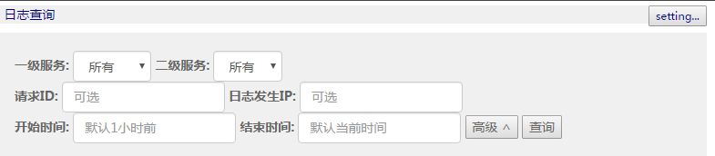
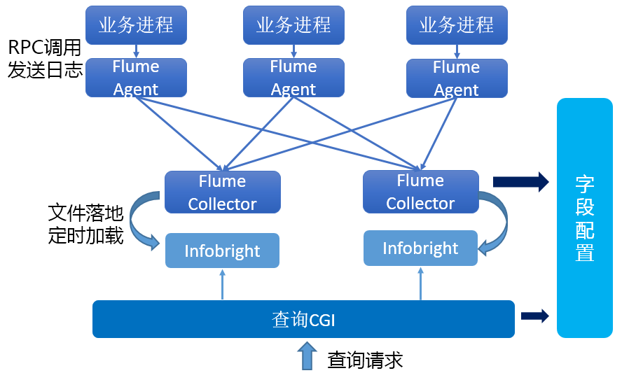
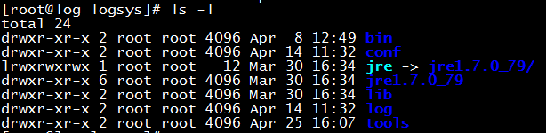
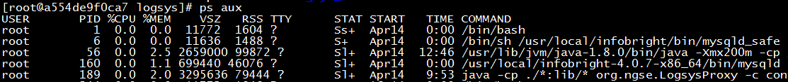

# 概述
    
## 背景

配合MSEC系统，完成日志的收集和查询，可用于定位系统故障。

# 使用说明
    
## 系统部署

主要分为两部分：agent和server, 安装方法见[msec安装与部署.docx](msec_install_guide.md)

## 写入日志

SRPC框架中已集成了日志写入的功能，调用RLOG相关接口即可完成日志写入。

## 查询日志

进入Web Console --- > 运维 --- > 日志，页面提供了日志查询的功能。

服务名为必选项，其他选项为可选项。

点击查询，即可显示筛选后的日志



## 日志系统设置

如上图，右上角，提供了两项功能的设置：

1.  字段设置

	支持业务自定义的字段，类型只能为整形和字符串。添加字段后，会自动在后台数据库表格中添加相应列。自定义字段只能增加不能删除，慎重。
	
	添加字段后，写入日志时， 可以调用NGLOG_SET_OPTION 设置，如：
	
	```c++
	NGLOG_SET_OPTION("FieldName", "FieldValue");
	```
	
	添加字段后，查询日志时，可以自动查询出新增的字段。

2.  染色设置

	染色是本日志系统提供的特别功能：当某条日志满足染色条件时，会无条件记录下来（忽略日志的级别）。

	例如：
	
	```ini
	FieldName0=QQ
	FieldValue0=12345678
	```
	
	以上配置为如果日志中设置的QQ号字段为12345678，则该条日志会自动记录到数据库中。
	
	染色功能主要为日志量较大时，提供了定位问题的方式。

# 总体设计
    
## 日志系统整体架构概述



整体的流程如下：  
1. 业务程序通过RPC调用将日志发送到Agent

2. Agent将日志发送到Collector，之间的路由方式采用LoadBalance(RoundRobin路由)

3. Collector将日志记录到本地日志文件

4. Collector定时将文件Load到Infobright

5. 查询CGI直接到所有Infobright机器查询

其中Agent和Collector都是采用apache flume

#  日志各模块说明

##  日志Agent

MSEC的所有Agent都是打包在一起进行安装的，其中就包含日志Agent，目录结构如下图。由于日志Agent为apache
flume，是java开发的，所以自带了jre.

当Agent有问题时，可在分析log目录下的日志定位。

Agent会根据NLB模块获取日志Server的日志，并将业务日志转发。



## 日志Server

日志Server中包含3个进程，打包为Docker镜像进行安装:

1.  logsys_svr 收集业务日志，并将日志数据定期Load到数据库中.

2.  logsys_proxy 提供日志查询的功能

3.  infobright 支持列存储的mysql

可以进入到docker container中查看：

```bash
docker exec --it <container id> /bin/bash
```

进入后可以看到以下几个进程，分别对应logsys_svr, logsys_proxy, mysql



logsys_svr和logsys_proxy都在docker镜像中的/usr/local/目录：


Mysql-infobright安装在/usr/local/infobright目录, 操作方法和mysql一致。

你也可以进入mysql查看具体的日志数据，端口为5029, 用户名默认为root， 密码为test@cai8dao! 数据库为logsys.

如果需要**清理或备份日志系统**的数据:

1.  直接利用mysql客户端连接上去操作对应的数据库logsys即可。

2.  Mysql的数据文件都在主机的/msec_data/logsys_data/目录，也可直接操作文件进行清理或备份

