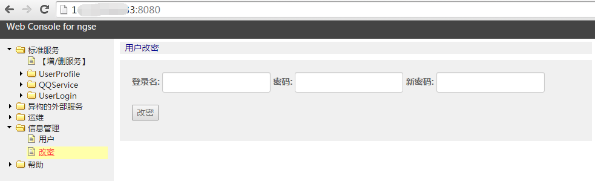
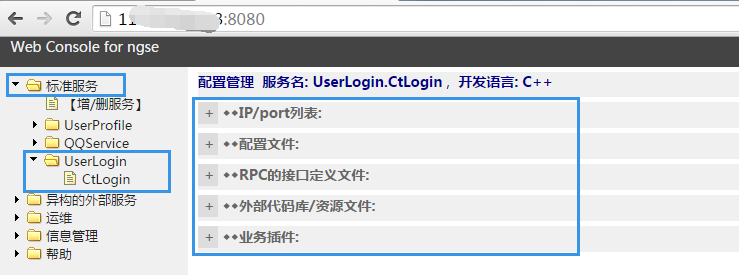
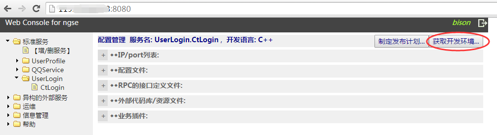
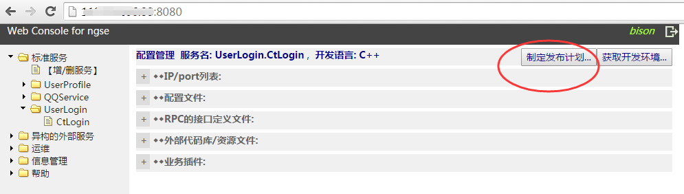
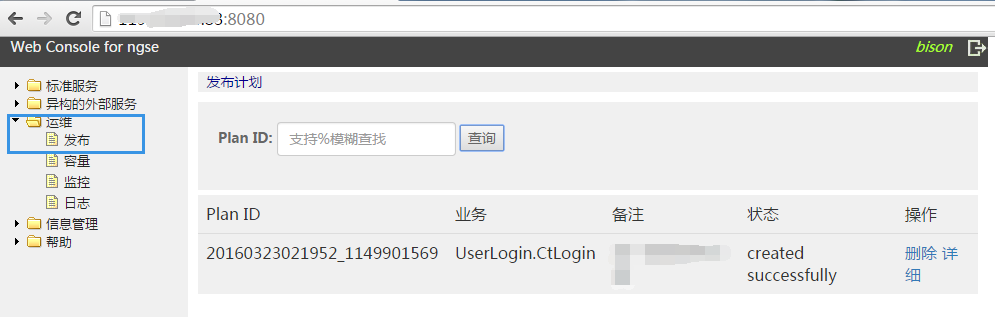
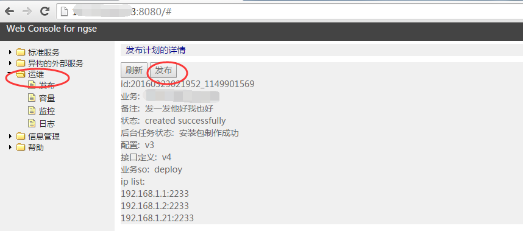
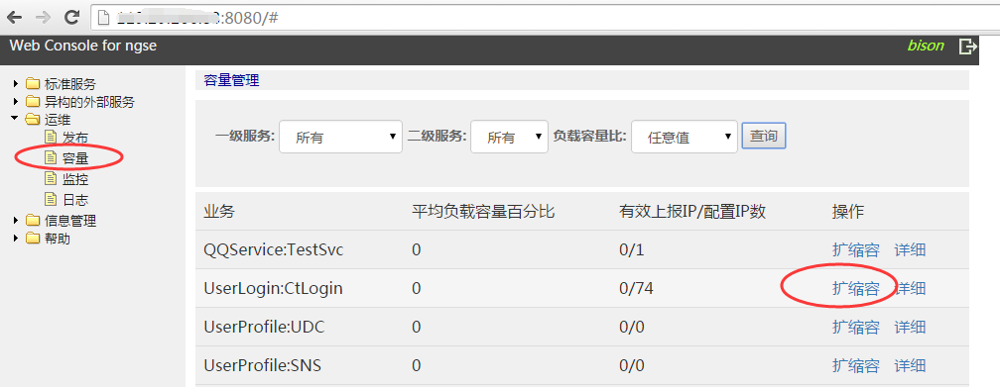
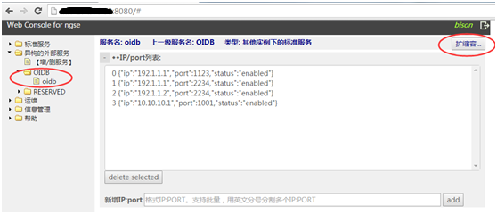
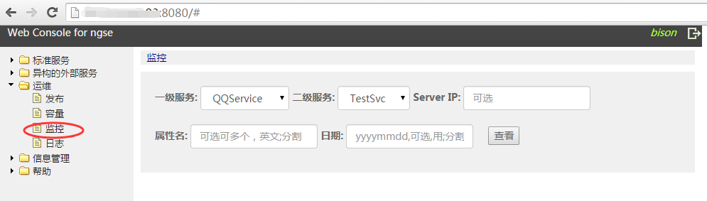
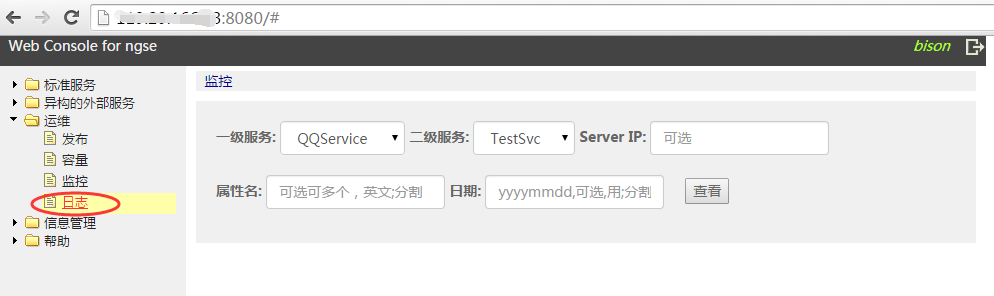

# msec console使用说明文档

*注意：Web
console只支持chrome浏览器，其他浏览器都没有测试。*

## 1.页面操作

### 1.1登录与账号管理

*系统预置了一个用户账号msec\_user，密码msec\_pass。*用该账号登录后，需要立即改密，并增加需要的其他账号。

### 1.2服务配置管理

服务有两种服务，一种是使用msec框架开发的服务，叫做标准服务；一种不是使用msec框架开发的服务(想象一下其他部门使用其他框架开发的基于GRPC的服务)，可能被标准服务调用，所以也需要管理起来，叫做异构的外部服务。

服务名字空间是树状的方式维护，有且只有两级。

异构的外部服务中，有两个预置的服务：RESERVED.monitor和RESERVED.log，是框架本身提供的服务监控和日志。他们不能被删除。

*注意：服务配置的操作，只是记录到web  console服务器后台中，要对业务的服务器实际生效，需要经过发布和扩缩容操作*

标准服务的配置，包括：

1.  IP/Port列表：配置该服务部署到哪些机器上面；1.0版本下，标准服务的端口是固定为7963，1.0以后的版本可配置；新增的IP状态为disabled，还不能处理请求报文，经过发布（安装程序）和扩容操作（经Load  Balance系统下发），状态将变成enabled状态，可以处理请求报文。

2.  配置文件：每个标准服务，有一个配置文件，可以配置日志级别、日志染色条件等。Web  Console提供简单的版本管理能力，支持配置文件的多个版本同时存在

3.  RPC的接口定义文件：指该服务提供的RPC接口描述，使用Protocol Buffer的描述文件格式。Web  Console提供简单的版本管理能力，支持该文件的多个版本同时存在。

4.  外部代码库/资源文件：如果该服务用到一些外部的库文件，例如涉及到密码学用到了openssl库，或者需要加载一个证书文件，那么需要把这些文件配置到这里。这里没有版本管理的能力。

5.  业务插件：业务逻辑开发，测试编译后，c++的打包为.so动态文件，java的打包为.jar文件，配置到这里。Web Console提供简单的版本管理能力，支持该文件的多个版本同时存在。

异构外部服务的配置，类似标准服务，只包含IP/port管理：

### 1.3服务的业务逻辑开发

增加了需要的服务后，点击获取开发环境，可以下载一个安装包，放到linux开发用机器上解开，获得一个标准的开发环境，开始业务逻辑的开发。

业务逻辑开发包括定义该服务的RPC接口、编写业务逻辑、编译测试等。

业务逻辑开发完成后，可以生成业务插件文件，配置到web console里，发布到运营机上。

### 1.4服务发布管理

服务配置好、业务逻辑也开发测试好以后，就可以发布到运营机上。

发布操作包括两步：第一步制作安装包；第二步进行实际的操作，分发到运营机上。

点击左侧树状菜单，打开标准服务的配置界面，点击“制定发布计划”，制作安装包：

制作好安装包后，就可以通过运维动作发布到运营机上

### 1.5服务容量管理

*注意：发布只是把程序文件部署到运营机器上并重启进程，但某一台运营机是否承接请求，是容量管理来决定的。通过扩缩容操作，决定一台运营机是否进入load balance系统处理业务请求报文。*

标准服务可以通过运维->容量->扩缩容菜单进行操作

异构服务在配置管理页面可以进行扩缩容：

### 1.6服务监控

### 1.7服务日志管理

毫秒2.0以前版本日志服务还比较简陋，后续版本将提供集群版本的日志服务

## 2.后台程序和数据

### 2.1关键的程序

有四个后台关键程序，在docker镜像执行的时候，通过运行**/etc/rc.d/rc.local**脚本启动了这四个程序。

#### 2.1.1 zookeeper

我们使用Zookeeper服务器作为Load Balance服务器

路径：/usr/local/zookeeper

主要程序/文件： bin/zkServer.sh, bin/zkCli.sh

端口号：8972

#### 2.1.2 mysql

我们使用mysql保存web站点的数据

路径：/usr/local/mysql

主要程序/文件: bin/mysqld_safe bin/mysql

端口号：127.0.0.1:3306

#### 2.1.3 remote_shell

我们使用remote_shell对业务运营机进行管理，可以传输文件、执行命令

路径：/usr/local/remote_shell

主要程序/文件：server.jar priv.txt

端口号：9981

特别说明：部署在业务运营机上的remote_shell_agent通过公钥密码算法实现对remote_shell
server进行身份认证，priv.txt文件就是remote_shell
server的身份文件，安装msec后需要立即进行更换并保密，具体做法见本文档的3.remote
shell身份认证

#### 2.1.4 tomcat

我们的console站点使用tomcat作为web服务器

路径：/usr/local/tomcat-8

主要程序/文件：webapp/ROOT下是msec console站点

端口：8080

### 2.2关键的数据

/msec/console_log是站点的log所在目录 log.log和err.log是当前的log

/msec/files是页面操作的时候产生的文件的目录，例如下载开发包什么的，其中：

/msec/files/ConfigFile：保存了每个服务的配置文件

/msec/files/IDLFile:保存了每个服务的IDL文件

/msec/files/library:保存了每个服务的库依赖文件

/msec/files/sharedobject保存了每个服务的业务插件

/msec/files/tmp安装包什么的

/msec/mysqldata mysql里数据的存储目录

/msec/tomcat_log tomcat的log目录

## 3.remote shell身份认证

部署在业务运营机上的remote\_shell\_agent接受web console服务器上的remote\_shell
\_server.jar程序的管理(1.0和以前的版本叫server.jar)，remote\_shell\_server.jar可以向agent发送文件、从agent获取文件、让agent执行一个脚本。

如果坏人恶意冒充remote\_shell\_server.jar，就可以对装有remote\_shell\_agent的机器为所欲为。

为了安全起见，remote\_shell\_server.jar和remote\_shell\_agent之间通过公钥密码算法对remote\_shell\_server.jar进行身份认证，即要求remote\_shell\_server.jar使用一个事先约定的保密的私钥对欲执行的命令脚本进行数字签名。remote\_shell\_server.jar所在目录下的priv.txt就是私钥文件，而业务运营机的/msec/agent/remote_shell目录下的pub.txt文件就是公钥文件。

另外，remote\_shell\_agent也只接受来自web console服务器这个IP的tcp连接，这也是一个安全措施。

msec环境搭建好以后，为了安全起见，需要重新生成priv.txt和pub.txt文件并分发到正确的目录下：

**step1:**

1.0及以前的毫秒版本：执行java -jar server.jar newRSAKey，生成两个文件priv.txt pub.txt，是新的密钥文件

2.0及以后的毫秒版本: 执行 genKey.sh，生成两个文件priv.txt pub.txt，是新的密钥文件

**step2:**

将pub.txt分发到所有业务运营机的/msec/agent/remote\_shell目录下，并重新启动remote\_shell\_agent。因为是使用docker，建议将这个改动commit到msec:console镜像。

**step3:**

重新启动web console上的remote\_shell

注意：后续部署新的业务运营机的agent，都需要使用新生成的pub.txt文件

