# MSEC是什么

## 简介

MSEC是一个开发+运营解决方案，不只是一个开发框架，适用于在廉价机器组成的集群上开发和运营分布式的互联网后台服务。MSEC的创作冲动和构建经验，来自QQ后台团队近10年的运营思考。

MSEC是简单的，它没有复杂的配置，也没有用到高深的技术。架构非常简单，有一定计算机基础的人都能很快理解它并掌握它。

## 特性

1.  **RPC和自动路由**：基于MSEC开发分布式后台服务，不需要关注网络调用、不需要关注负载均衡、不需要关注单机故障/网络局部波动。
    MSEC提供RPC方式来实现模块间调用，就跟单机程序里的函数调用一样自然，MSEC自动进行路由，自动实现负载均衡和调整，自动实现对单机故障/网络局部波动的容错。

2.  **微线程**：MSEC支持c/c++语言开发，业务逻辑的编写是同步的方式，避免为了执行的高效率而将业务代码在远程调用处拆分成非常难以理解的回调函数的异步方式；同时，业务逻辑的执行却是异步的，在用户态实现了多执行流的上下文切换，非常高效。MSEC兼顾了开发的高效率和执行的高效率。

3.  **业务监控**：提供业务自定义的上报并可以用曲线图的方式查看；对于模块间的调用情况自动上报并可查看

4.  **业务处理路径一目了然：**集中的业务日志记录和查询服务，对业务处理路径和模块间调用关系生成流程图，一目了然。

5.  **支持c/c++，java，PHP等开发语言**

6.  **接口管理、发布管理、容量管理web化**

7.  **易于运营的KV存储 （基于redis-cluster）**

## 架构简介

如下图，整个系统由下面几部分组成：

1.  集中化控制台：包括MSEC的集中化服务管理页面以及一系列集中化服务，包括：
    
      - 名字发现和路由服务：基于zookeeper服务程序，负责每个业务服务名到IP的映射信息的管理和分发。
    
      - 远程命令数据传输服务：Remote_shell server程序和remote_shell agent程序使得web console服务器可以对业务运营机下发或者获取文件、执行命令。业务运营机通过非对称密码算法对remote_shell server进行认证。具体的就是server持有私钥文件，agent持有公钥文件。Server下发的命令必须经过私钥签名，agent将验证签名，通过才执行命令。
    
      - 监控服务：提供业务上报信息的存储和查询服务。业务上报信息存储在内存里，推荐内存8G~16G。定时dump到磁盘的方式防止数据掉电丢失。
    
      - 日志服务：提供业务日志的存储和查询服务。日志存储在mysql表里。


2.  业务运营服务器：部署开发框架和业务实例，处理业务请求。部署业务实例需要先部署集中化服务的Agent。

3.  KV集群：MSEC提供了一套Web化运维管理服务页面，供业务进行KV系统的运维操作，包括Web化的容量管理、监控视图展现等。

	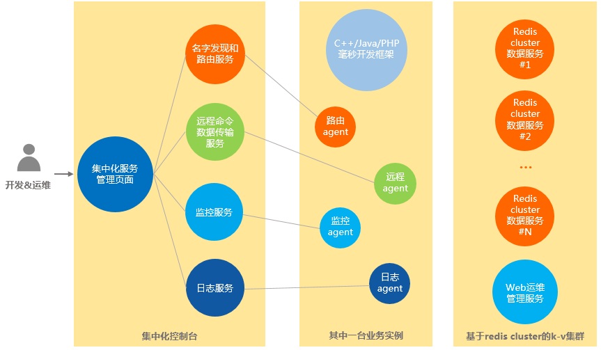

## 一个简单的示例

### 场景说明

场景如下：我们要开发一个航班查询系统。我们将创建Flight->mode_flight这样一个业务服务模块，客户端调用该模块提供的RPC接口，输入用户名密码，返回航班信息。

### Step1:机器准备

1. 首先在业务运营机器上一键安装必要的agent：

	1. 将agent_dist.tar.gz拷贝到机器上，
	
	2. 解开：tar zxf agent_dist.tar.gz，得到agent_dist目录
	
	3. 重命名目录：mv agent_dist /msec/agent (必须是这个目录，不可以另外自定义)
	
	4. 启动agent：/msec/agent/start.sh {webconsole_IP} {与webconsole通信的本地网卡名，例如eth0}

2. 增加标准服务Flight.mod_flight

	

	并将机器IP配置到对应的服务里

	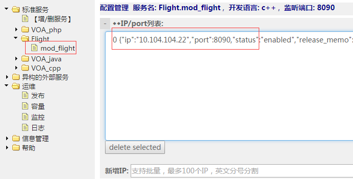

	创建默认的配置文件：格式示例=》保存为新版本：

	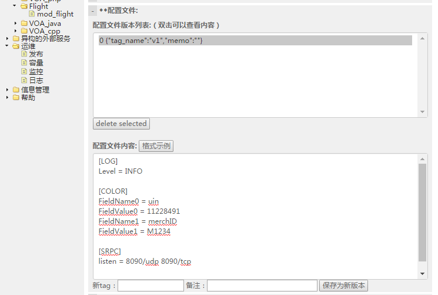

### Step2:开发业务逻辑

1. 编写接口定义文件

	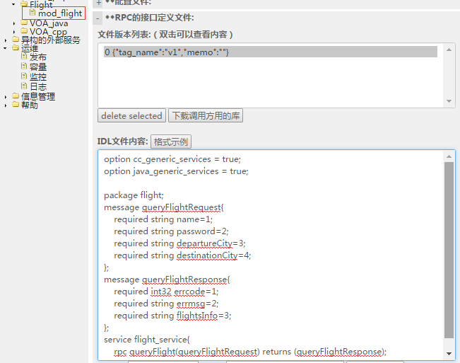
	
	为了方便用户复制粘贴，IDL文件内容这里给出：
	
	```protobuf
	option cc_generic_services = true;
	option java_generic_services = true;
	package flight;
	
	message queryFlightRequest{
	required string name=1;
	required string password=2;
	required string departureCity=3;
	required string destinationCity=4;
	};
	
	message queryFlightResponse{
	required int32 errcode=1;
	required string errmsg=2;
	required string flightsInfo=3;
	};
	
	service flight_service{
	rpc queryFlight(queryFlightRequest) returns (queryFlightResponse);
	}
	```

2. 下载开发包

	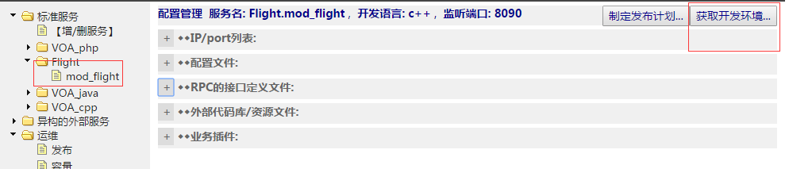

3. 解开开发包，编写业务代码并编译

	找到msg_flight_impl.cpp添加很简单的业务代码：
	
	```c++
	int Cflight_serviceMsg::queryFlight(const queryFlightRequest* request,
	queryFlightResponse* response)	
	{	
		// TODO 处理业务逻辑实现	
		//先调用远程接口检查用户名密码是否正确，这里要到mod_user下载调用方用的库，并加到当前目录下	
		if (request->name() == "bison" && request->password() == "123456")	
		{	
			//返回航班信息	
			response->set_errcode(0);	
			response->set_errmsg("success");	
			response->set_flightsinfo("{春秋航空;c8835;RMB1230}");	
			return 0;	
		}	
		else	
		{	
			response->set_errcode(-1);	
			response->set_errmsg("invalid user");	
			response->set_flightsinfo("");	
			return 0;	
		}
	}
	```

4. 编译并上传插件

	编译

	

	并将生成的业务代码插件配置到服务里：

	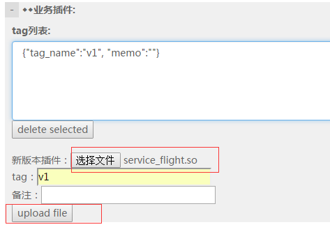

### Step3:部署业务代码

1. 制作发布计划

	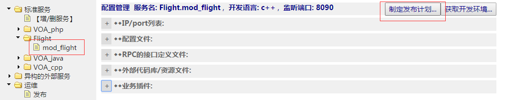

2. 执行发布

	

	发布展示的结果如下：（部分）
	
	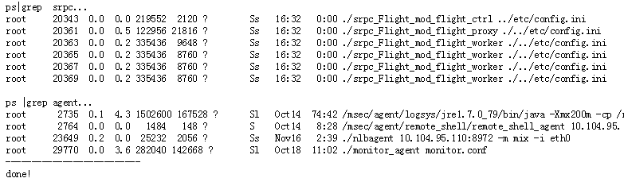

### Step4:扩容，正式提供服务

将已经完成发布部署的机器加入到名字发现和路由服务系统，正式对外提供服务

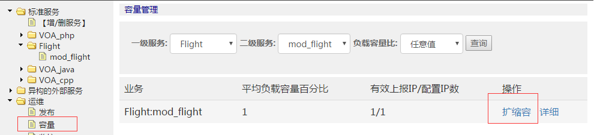

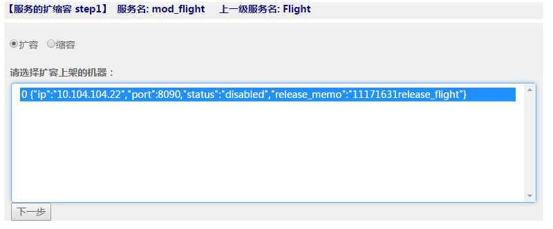

### Step5: 编写客户端代码，发送请求

进入到flight/flight_client目录，修改client_flight_sync.cpp文件：

```c++
// 定义目标服务与请求消息
CRpcUdpChannel channel("10.104.104.22:8090");
queryFlightRequest request;
request.set_name("bison");
request.set_password("123456");
request.set_departurecity("sz");
request.set_destinationcity("xz");

// 执行RPC调用
flight_service::Stub stub(&channel);
CRpcCtrl ctrl;
queryFlightResponse response;
stub.queryFlight(&ctrl, &request, &response, NULL);

// 检查结果
if (!ctrl.Failed())
{
    cout << "Received response OK!" << response.DebugString() << endl;
}
else
{
    cout << ctrl.ErrorText() << endl;
	cout << response.flightsinfo()<<endl;
}
```

编译，然后执行：


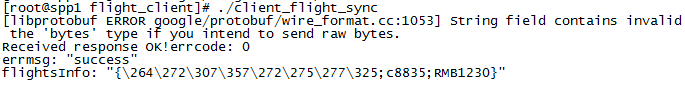

### Step6: 查看监控信息

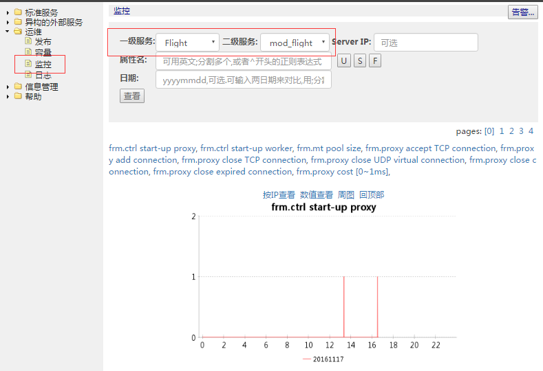

