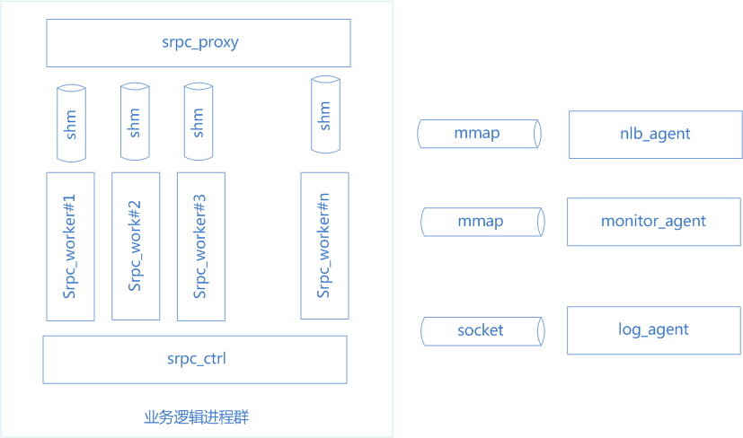

# PHP开发者手册

MSEC是一个开发+运营解决方案，SRPC是在C++框架的基础上加入了PHP语言的支持。本文主要介绍如何使用PHP在MSEC中开发业务代码。

# 1\. SRPC支持PHP简介

## 1.1. 整体架构

如上图所示，业务逻辑进程群有三类进程：

**srpc_proxy**:负责和客户端的连接管理、收包、回包等工作

**srpc_ctrl**:负责管理proxy、worker进程，包括启动、拉起等工作

**srpc_worker**:通过zend API调用PHP脚本完成实际业务逻辑处理，通过共享内存与proxy交互外部请求和应答报文

业务逻辑进程群通过mmap和socket的方式，与三个agent进程交互，实现路由信息的获取、监控上报、日志上报

## 1.2. PHP支持

SRPC对PHP的支持比较简单，使用底层zend API对PHP环境做初始化，然后调用PHP用户态函数。大致伪码如下：

>php\_embed\_init(0, NULL PTSRMLS\_CC); // 初始化PHP环境
> 
> while (true)
> 
> {
> 
> recv\_pkg(request); // 接收来自proxy的请求包
> 
> response = call\_user\_function();// 调用开发者实现的PHP用户态函数
> 
> send\_pkg(response); // 回复回复包给proxy
> 
> }
> 
> php\_embed\_shutdown(TSRMLS\_C); // 去初始化PHP环境

## 1.3. PHP环境

### 1.3.1. 编译环境

SRPC内部会自带PHP的运行环境，基于php-5.6.25，配置参数如下：

> ./configure --enable-debug --without-pear --disable-xmlreader
> --disable-xmlwriter --disable-xml --disable-libxml --disable-dom
> --disable-simplexml --enable-sockets --enable-maintainer-zts
> --disable-cgi --enable-json --enable-cli --enable-embed
> --with-mysql=mysqlnd --with-mysqli=mysqlnd --with-pdo-mysql=mysqlnd
> --enable-pdo;

如果业务开发者需要重新编译PHP，请采用对应的兼容版本。

### 1.3.2. PHP插件

MSEC的监控、日志、寻址等特性都是通过PHP扩展的方式给予支持。

# PHP编码

## 2.1. 协议定义

SRPC的协议完全使用google protobuf，
PHP同样支持progobuf，协议的定义实际上就是一个proto文件。在MSEC中，开发同学只需要在web console页面上定义好协议即可。

**【注意】 后续章节介绍，示例都采用该协议**

> // 包名, 建议小写 linux 命令风格: echo
> 
> package echo;
> 
> // 请求消息定义
> 
> message EchoRequest
> 
> {
> 
> optional bytes message = 1;
> 
> }
> 
> // 应答消息定义
> 
> message EchoResponse
> 
> {
> 
> optional bytes message = 1;
> 
> }
> 
> // 定义服务, 建议首字符大写，只允许定义一个
> 
> service EchoService
> 
> {
> 
> // 定义方法, 可以多份
> 
> rpc EchoTest(EchoRequest) returns (EchoResponse);
> 
> }

## 2.2. 生成代码

通过web console页面可以下载开发环境tar文件，解开后目录如下：

> echo
> 
> |-- echo\_client // 客户端代码
> 
> | |-- EchoService\_client.php // 客户端实现 【业务可修改】
> 
> | |-- README.client
> 
> | |-- call\_service.php // 包含callmethod方法实现
> 
> | |-- libsrpc\_proto\_php\_c.so // rpc协议相关库
> 
> | |-- nlb\_php.so // nlb插件
> 
> | |-- pb4php
> 
> | |-- pb\_proto\_service.php // 自动生成的php protobuf文件
> 
> | |-- php // php命令行工具
> 
> | |-- php.ini // php配置文件
> 
> | |-- service.proto
> 
> | \`-- srpc\_comm\_php.so // rpc打解包插件
> 
> \`-- echo\_server // 服务器端代码
> 
> |-- EchoService.php // 业务实现 【业务可修改】
> 
> |-- build.sh //
> 
> |-- call\_service.php // 包含callmethod方法实现
> 
> |-- entry.php // php入口函数
> 
> |-- pb4php // 第三方库
> 
> |-- pb\_proto\_service.php // 自动生成的php protobuf文件
> 
> |-- php.ini // php配置文件，可在此基础上修改
> 
> \`-- service.proto

如果服务端调用另外一个标准服务A，需要从web console的标准服务A的配置页面下载调用方用的库。

## 2.3. 实现服务器业务逻辑

在echo\_server/EchoService.php文件下，业务可以修改业务代码实现。

> /\*\*
> 
> \* @brief 自动生成的业务方法实现接口
> 
> \* @param request \[入参\]业务请求报文，可能是序列化后的protobuf或者json报文
> 
> \* is\_json \[入参\]是否json报文
> 
> \* @return 业务回复报文，pb序列化后的报体
> 
> \*/
> 
> public function EchoTest($request, $is\_json)
> 
> {
> 
> /\*\*
> 
> \* 1. json格式报文处理
> 
> \*/
> 
> if ($is\_json)
> 
> {
> 
> // TODO: json格式报文
> 
> // 1. $request为json格式字符串
> 
> // 2. 需要返回json格式字符串，而非json对象
> 
> return $request;
> 
> }
> 
> /\*\*
> 
> \* 2. protobuf格式报文处理
> 
> \*/
> 
> /\* 自动生成部分，反序列化请求包体 \*/
> 
> $req = new EchoRequest();
> 
> $req-\>ParseFromString($request);
> 
> $rsp = new EchoResponse();
> 
> // TODO: 业务逻辑实现
> 
> $rsp-\>set\_message($req-\>message());
> 
> /\* 序列化回复包体 \*/
> 
> $response = $rsp-\>serializeToString();
> 
> return $response;
> 
> }

## 2.4. 调用其它SRPC业务

通过调用callmethod接口，可以完成其它SRPC业务的调用。

> /\*\*
> 
> \* @brief 调用其它业务
> 
> \* @param $service\_name 业务名，用作寻址，可传入IP地址或业务名("login.web" or
> "10.0.0.1:1000@udp")
> 
> \* $method\_name 方法名，pb规定的业务名，带namespace("echo.EchoService.EchoTest")
> 
> \* $body 序列化后的包体
> 
> \* $timeout 超时时间，单位毫秒
> 
> \* @return 回复包体+错误信息的数组
> 
> \* @notice 1. 需要首先判断返回值的 $return\['errmsg'\]是否等于"Success"
> 
> \* 2. 如果等于Success，则可以取出包体 $return\['rsp'\]做反序列化
> 
> \*/
> 
> function callmethod($service\_name, $method\_name, $body, $timeout)

## 2.5. PHP扩展

### 2.5.1. nlb扩展

nlb的php扩展库为nlb\_php.so，提供两个接口：

  - getroutebyname

获取路由信息

  - updateroute

更新路由信息，用于做回包统计

使用示例：

> // 获取路由示例
> 
> // 参数 -- 业务名： string 类型
> 
> // 返回值 -- null：失败
> 
> // -- 路由信息数组，包含“ip”，“port”，“type”
> 
> $route = getroutebyname("login.ptlogin");
> 
> if ($route == null)
> 
> echo "getroutebyname error";
> 
> else
> 
> {
> 
> $ip = $route\["ip"\];
> 
> $port = $route\["port"\];
> 
> $type = $route\["type"\]; // type有3种情况：udp，tcp，all (tcp and udp)
> 
> }
> 
> // 更新路由示例
> 
> // 参数1 -- 业务名: string类型
> 
> // 参数2 -- ip地址: string类型
> 
> // 参数3 -- 是否成功: bool类型
> 
> // 参数4 -- 时延：int类型
> 
> updateroute("login.ptlogin", $ip, true, 1000);

### 2.5.2. monitor扩展

monitor的php扩展库为monitor\_php.so，提供两个接口：

  - attr\_set

上报即时属性值

  - attr\_report

上报累计值

使用示例：

> // 上报即时值示例
> 
> // 参数1 -- 属性名： string类型
> 
> // 参数2 -- 上报数值： int类型
> 
> attr\_set("report test", 100);
> 
> // 上报累加值示例
> 
> // 参数1 -- 属性名： string类型
> 
> // 参数2 -- 可选 累加数值，默认为1: int类型
> 
> attr\_report("report test");
> 
> attr\_report("report test", 100);

### 2.5.3. log扩展

log的php扩展库为log\_php.so，提供丰富的接口，分两类：

  - 设置日志选项

<!-- end list -->

  - 打印日志接口

使用示例：

> // 设置日志选项示例
> 
> // 参数1 -- 选项名： 任意基础类型
> 
> // 参数2 -- 选项值： 任意基础类型
> 
> nglog\_set\_option("username", "obarma")；
> 
> // 打印日志示例
> 
> // 参数 -- 日志字符串：string
> 
> nglog\_error("get data failed");
> 
> nglog\_info("get data failed");
> 
> nglog\_debug("get data failed");
> 
> nglog\_fatal("get data failed");

### 2.5.4. 读配置文件

标准服务都统一有一个ini格式的配置文件，在web console页面里管理。业务的php代码可以使用下面的API来读取该配置文件：

> string get_config(string session, string key);

### 2.5.5. 协议打解包扩展

协议打解包的php扩展库为srpc\_comm\_php.so，其依赖系统库libsrpc\_proto\_php\_c.so。提供三个接口：

  - srpc\_serialize  //打包接口

  - srpc\_deserialize  //解包接口

  - srpc\_check\_pkg   //tcp方式访问，检查报文是否收到了完整报文

使用示例如下：

> $request = new EchoRequest();
> 
> $body\_str = $request-\>serializeToString();
> 
> $seq = rand();
> 
> // 打包示例
> 
> // 参数1 -- 业务方法名： string类型
> 
> // 参数2 -- 包体：string 【注意】为protobuf序列化后的二进制字符串
> 
> // 参数3 -- 序列号：int 用来判断收发包报文以否一致，防止窜包
> 
> // 返回值 -- null：失败
> 
> // 非null：成功 为打包好后的二进制包
> 
> $req\_pkg = **srpc\_serialize**("echo.EchoService.EchoTest",
> $body\_str, $seq);
> 
> if ($req\_pkg === null)
> 
> {
> 
>>echo "srpc\_pack failed";
> 
>>return -1;
> 
> }
> 
> \------------------------------------------------------------
> 
> // 业务收发包: 伪代码
> 
> $rsp\_pkg = send($addr, $req\_pkg);
> 
> // 如果使用tcp，需要截包，插件提供一个检查报文是否收完的接口
> 
> // 函数名： srpc\_check\_pkg
> 
> // 参数 ： 报文：string类型
> 
> // 返回值： null -- 解包失败
> 
> // 0 -- 报文不完整
> 
> // \>0 -- 报文完整，长度为返回值
> 
> // 使用示例：
> 
> // $ret = **srpc\_check\_pkg**($rsp\_pkg);
> 
> // if ($ret === null)
> 
> // {
> 
>> // echo "srpc\_check\_pkg failed\\n". // 非法报文
> 
> // }
> 
> // else if ($ret === 0)
> 
> // {
> 
>> // echo "continue recevice package\!\\n"; // 报文不完整
> 
> // }
> 
> // else
> 
> // {
> 
>> // echo "recevice complate\!\\n"; // 报文完整，$ret为报文实际长度
> 
> // }
> 
> \-------------------------------------------------------
> 
> // 解包示例
> 
> // 参数 -- 报文：string类型
> 
> // 返回值 -- 返回值为一个数组，包含"ret"，"errmsg"，"seq"，"body"；
> 
> // 都是string类型
> 
> // 【注意】 
> 
> // 1. 先要判断ret为0；
> 
> // 2. 再判断seq是否和打包时一致；
> 
> // 3. 1，2判断都正确，才能把body当成正确的报文解包；
> 
> // 该函数使用示例可参见开发包的call\_service.php文件
> 
> $ret = **srpc\_deserialize**($rsp\_pkg);
> 
> if (($ret\['ret'\] \!== 0) )
> 
> {
> 
>> echo "srpc\_unpack failed";
> 
>> return -2;
> 
> }
> 
> if (\!$ret\['seq'\] \!= $seq)
> 
> {
> 
>> echo "the sequence is inconsistent";
> 
>> return -3;
> 
> }
> 
> $body\_str = $ret\['body'\];
> 
> $response = new EchoResponse();
> 
> $response-\>ParseFromString($body\_str);

### 2.5.5. 其它新加扩展

详细见官网视频[http://haomiao.qq.com/vod/msec_extend_php.html](http://haomiao.qq.com/vod/msec_extend_php.html "扩展php")

  - **PHP原生扩展**

原生扩展指PHP自带的扩展，但是框架默认并没有编译进去，需要重新编译一个libphp5.so以给予支持。

业务自己下载源码，重新编译出libphp5.so，提交到web console标准服务配置管理里的外部代码库即可。

  - **PHP外部扩展**

PHP本身没有支持的外部扩展的.so文件，提交到web console标准服务配置管理里的外部代码库即可，并修改业务代码里的php.ini即可。

  - **phar包及PHP源码**

phar包及需要包含的PHP源码，可以放到自动生成代码的目录下，和其它PHP源文件一样使用。

## 2.6. http+json支持

  - **请求报文格式**

> POST /127.0.0.1:7963?methodName=echo.EchoService.Echo
> 
> Content-Type: aplication/json; charset=UTF-8
> 
> Content-Length: 26
> 
> {"message": "hello world"}

【注意】请求参数中需要带RPC方法名

  - **回复报文格式**

> HTTP/1.1 200 OK
> 
> Content-Type: aplication/json; charset=UTF-8
> 
> Content-Encoding: UTF-8
> 
> Content-Length: 63
> 
> {"ret":0, "errmsg":"", "resultObj": {"message": "hello
world"}}

【注意】回复报文的http消息体带框架返回的错误信息，resultObj才是业务返回的json字符串。业务需要先判断ret是否为0，不为0就表示错误，这时不会有resultObj。

