# msec服务开发详解（python）

## 示例的场景描述

这里我们会以一个实际的例子来说明如何基于msec开发一个服务。

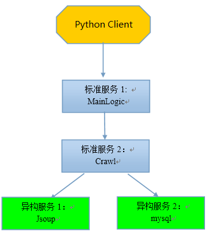

如上图所示，业务流程如下：

1.  python client访问MainLogic，请求拉取英语听力mp3列表。如果希望通过C/C++（如cgi）访问MainLogic，请参考[msec服务开发详解(cpp)](cpp_dev_guide.md)文档相关章节。

2.  MainLogic收到请求后，先请求一下异构服务mysql，再请求Crawl

3.  Crawl也没有mp3列表，转而请求异构服务Jsoup

4.  Jsoup是一个抓去网上MP3英语听力文件的服务，逐级把mp3列表返回给Crawl和MainLogic

5.  MainLogic收到mp3列表后，并返回给客户端

**这个例子比较典型，包括好几种远程调用场景：**

1.  场景一：其他模块调用标准服务（python client用MainLogic的GetTitles接口和GetUrlByTitle接口）

2.  场景二：标准服务A调用标准服务B（MainLogic调用Crawl的GetMP3List接口）

3.  场景三：标准服务A调用异构服务B，异构服务B提供接口API的形式（MainLogic调用mysql）
  
4.  场景四：标准服务A调用异构服务B，异构服务B提供接口协议文档的形式（Crawl调用Jsoup）

5.  场景五：其实还有一种情况，A部门部署了一个msec，B部门也部署了一个msec，A部门的标准服务a调用B部门的标准服务b

## 具体步骤

### Step1：在msec console上添加上述服务

如下所示：

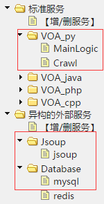

### Step2：配置标准服务

添加MainLogic服务的部署IP：

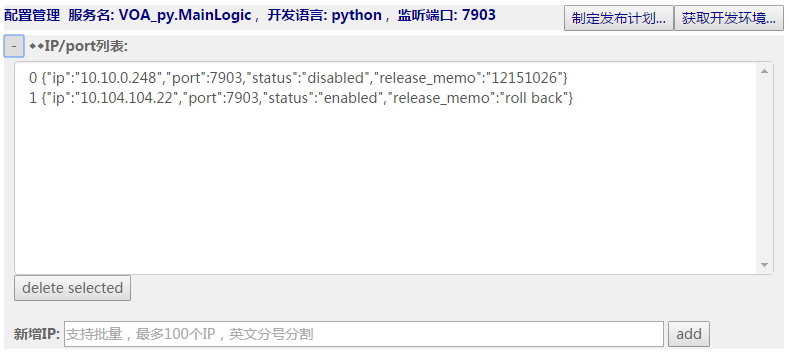

添加MainLogic服务的配置文件,用默认配置文件即可：

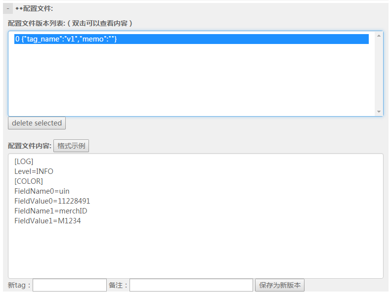

添加MainLogic服务的接口定义文件（protocol buffer方式）：

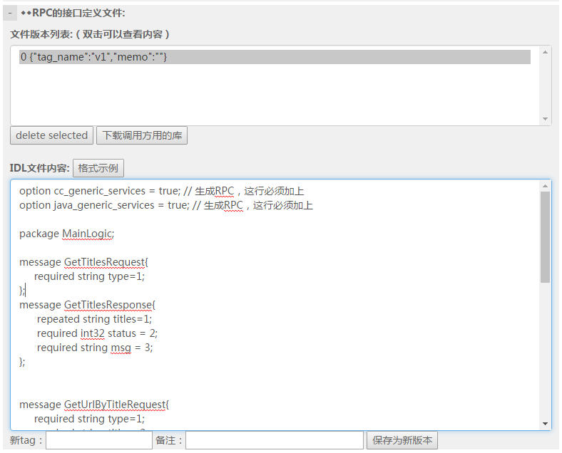

如果用到其他库文件，例如使用了mysql服务，那么可能需要引入MySQL-python库，那就配置到外部库中

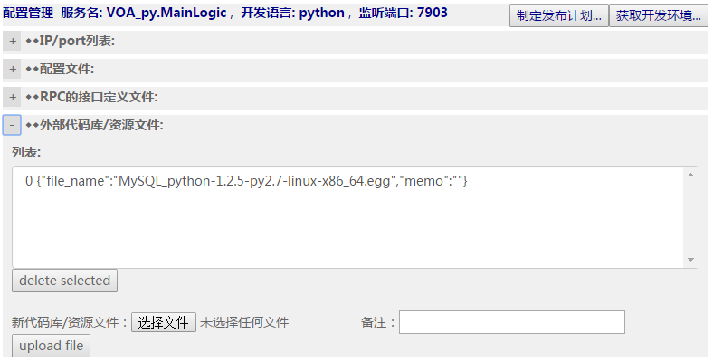

类似的，也配置好标准服务Crawl。这里给一下接口定义文件的文本，方便大家拷贝试做

MainLogic的接口定义文件：

```protobuf
option cc_generic_services = true; // 生成RPC，这行必须加上
option java_generic_services = true; // 生成RPC，这行必须加上
package MainLogic;

message GetTitlesRequest{
	required string type=1;
};

message GetTitlesResponse{
	repeated string titles=1;
	required int32 status = 2;
	required string msg = 3;
};

message GetUrlByTitleRequest{
	required string type=1;
	required string title = 2;
};

message GetUrlByTitleResponse{
	optional string url=1;
	required int32 status = 2;
	required string msg = 3;
};

message DownloadMP3Request
{
	required string type=1;
	required string title = 2;
}

message DownloadMP3Response
{
	required int32 status = 1;
	required string msg=2;
	optional int32 file_len=3;
	optional bytes file_content=4;
}

service MainLogicService{
	rpc GetTitles(GetTitlesRequest) returns (GetTitlesResponse);
	rpc GetUrlByTitle(GetUrlByTitleRequest) returns (GetUrlByTitleResponse);
	rpc DownloadMP3(DownloadMP3Request) returns (DownloadMP3Response);
}
```

Crawl的接口定义文件如下：

```protobuf
option cc_generic_services = true; // 生成RPC，这行必须加上
option java_generic_services = true; // 生成RPC，这行必须加上
package crawl;

message OneMP3
{
	required string title = 1;
	required string url = 2;
}

message GetMP3ListRequest{
	required string type=1; //标准英语还是慢速英语
};

message GetMP3ListResponse{
	repeated OneMP3 mp3s=1;
	required int32 status=2;
	required string msg=3;
};

service CrawlService {
	rpc GetMP3List(GetMP3ListRequest) returns (GetMP3ListResponse);
}
```

### Step3：开发标准服务MainLogic

1. 点击MainLogic服务的“获取开发环境”的按钮，下载开发包

	

2. 在开发机上展开，进入到MainLogic_server目录

	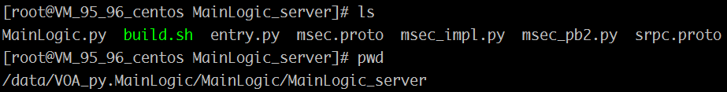

3. 因为MainLogic服务访问Crawl，所以还需要用到Crawl的接口API，如何获得呢？

	在Crawl的配置页面那里，下载调用方用到的库：

	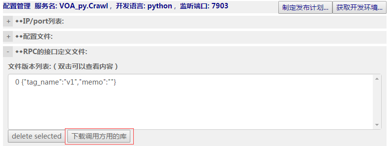

	下载后可以看到里面的python文件夹下有VOA_py_Crawl_pb2.py文件，将这个文件放到MainLogic服务开发机的的目录MainLogic_server下，我们就可以调用Crawl服务提供的接口。

	修改MainLogic.py，增加业务代码，并`import VOA_py_Crawl_pb2`。

	其中值得关注的是如何访问Crawl服务，也就是场景二：标准服务调用标准服务：

	```python
	def GetTitles(self, req_data, is_json):

        # 自动生成部分，反序列化请求包体
        request = msec_pb2.GetTitlesRequest()
        response = msec_pb2.GetTitlesResponse()

        # json协议处理
        if is_json:
            req_json = json.loads(req_data)
            request = protobuf_json.json2pb(request, req_json)
        else:
            request.ParseFromString(req_data)

        # TODO: 业务逻辑实现
        level = get_config('LOG', 'Level')
        if level:
            log_info(level)
        level = get_config('LOG', 'level')
        if level:
            log_info(level)
		
        crawlreq = VOA_py_Crawl_pb2.GetMP3ListRequest()
        crawlreq.type = request.type
        result = CallMethod("VOA_py.Crawl", "crawl.CrawlService.GetMP3List", crawlreq, 20000)
        if result["ret"] != 0:
            response.status = 100
            response.msg = "CallMethod failed: "+result["errmsg"]
            log_error('callmethod error: %d %s' % (result["ret"], result["errmsg"]))
        else:
            crawlrsp = VOA_py_Crawl_pb2.GetMP3ListResponse()
            crawlrsp.ParseFromString(result["response"])
            if crawlrsp.status != 0:
                log_error('getmp3list response error: %d %s' % (crawlrsp.status, crawlrsp.msg))
                response.status = 100
                response.msg = "getmp3list response failed: " + crawlrsp.msg
            else:
                response.status = 0
                response.msg = "success"
                for mp3 in crawlrsp.mp3s:
                    response.titles.append(mp3.title)
                log_info( 'GetTitles Success')
                attr_report('GetTitles success')

        # 序列化回复包体
        if is_json:
            return json.dumps(protobuf_json.pb2json(response))
        else:
            return response.SerializeToString()
	```

	这里为了支持json，我们使用了一个三方的protobuf和json互换的库：[protobuf_json](https://github.com/dpp-name/protobuf-json/blob/master/protobuf_json.py)

	另一个值得关注的是如何访问mysql服务，也就是场景三：标准服务调用异构服务
	
	首先配置异构服务mysql的IP列表，并通过扩缩容操作，将新加入的IP扩容到负载均衡系统里，这样就能被其他服务访问到。点击右上角的扩缩容按钮。该IP的状态由disabled变成enabled
	
	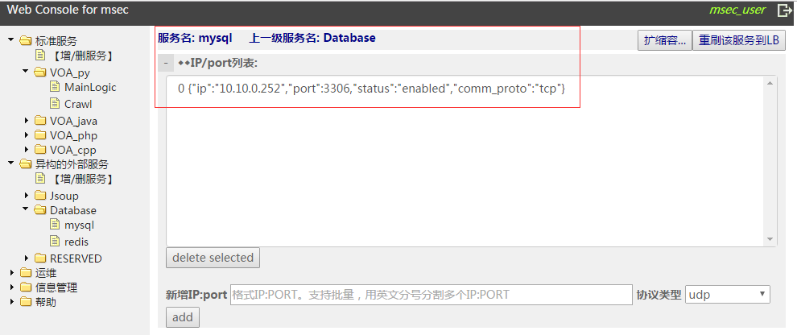
	
	关于通过lb路由服务获取业务ip信息，主要的api如下：
	
	getroute通过业务名获取路由信息；updateroute更新路由统计信息，用于lb做回包统计。如果不需要回包统计做动态路由，可以不用调用updateroute。

	然后写代码如下，我们使用了三方MySQL-python库
	
	```python			
	try:
	    import MySQLdb  #mysql
	except ImportError:
	    log_error("Fail to import mysql library.")
	else:
	    route = getroute("Database.mysql")
	    if route:
	        # 打开数据库连接
	        db = MySQLdb.connect(route["ip"], "msec", "msec@anyhost", "msec_test_java_db", route["port"])
	        cursor = db.cursor()
	        cursor.execute("SELECT VERSION()")
	        data = cursor.fetchone()
	        log_info("Database version : %s" % data)
	        db.close()
	```

	为了方便直接拷贝试用，这里给出了完整文件：[MainLogic.py](examples/dev_python/MainLogic.py)

### Step4：编译MainLogic服务

我们对代码在linux上执行`./build.sh`，生成msec_py.tgz这样一个业务插件。将该业务插件上传到msec console：

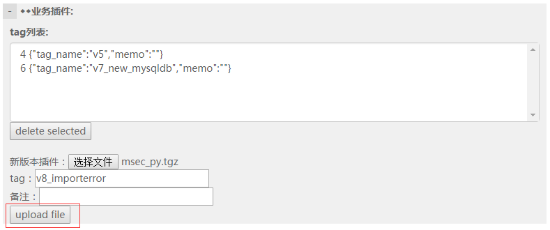

### Step5：开发标准服务Crawl

类似MainLogic，也是从msec console下载crawl服务的开发环境，并在开发机上展开，修改crawl.py文件，增加业务逻辑。

Crawl服务的业务逻辑比较简单，访问Jsoup这个异构服务，拉取一个英语mp3文件的(文件标题， 文件url)的列表。

这里值得特别注意的是：这是场景四：标准服务访问一个异构服务，该异构服务提供了接口协议文档。

首先，配置Jsoup的IP并扩容到负载均衡管理系统里：


然后就写代码如下：

```python
json_req = {"handleClass":"com.bison.GetMP3List",  "requestBody": {"type": request.type} }
json_ret = self.callmethod_tcp( "Jsoup.jsoup", json_req, self.callback, 10.0)
if json_ret["ret"] != 0:
    response.status = 100
    response.msg = json_ret["errmsg"]
else:
    if json_ret["data"]["status"] != 0:
        response.status = 100
        response.msg = "jsoup returns "+str(json_ret["data"]["status"])
    else:
        response.status = 0
        response.msg = "success"
        log_info("GetMP3List successfully")
        monitor_add("GetMP3List succ")
        for mp3 in json_ret["data"]["mp3s"]:
            one_mp3 = response.mp3s.add()
            one_mp3.url = mp3["url"]
            one_mp3.title = mp3["title"]
```

这里的关键就是通过路由服务获取业务对应的ip，然后通过Python网络调用函数收发获取业务数据，最后完成解包。

为了方便拷贝试做，这里给出完整文件：[crawl.py](examples/dev_python/crawl.py)

### Step6：Python客户端访问MainLogic标准服务

首先从MainLogic的配置页面下载调用方用的库：


下载下来后，里面包含了访问该pb接口的客户端API，支持C++/Java/PHP/Python等语言。因为是python开发，所以我们用python的api：

1.  展开下载的tar包，这里要取出的是python路径下的protobuf协议封装文件以及在3rd_API.tar.gz里的python文件夹里的文件，将他们放到同一个目录，如下图所示：

	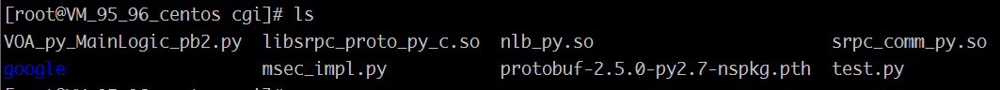

2.  写一个test.py文件，其主要逻辑是调用MainLogic模块：

	```python
	import VOA_py_MainLogic_pb2
	from msec_impl import *

	if __name__ == '__main__':
	    sock = socket.socket(socket.AF_INET, socket.SOCK_STREAM)
	    sock.connect(host)
	    sock.setblocking(0)
	
	    request = VOA_py_MainLogic_pb2.GetTitlesRequest()
	    response = VOA_py_MainLogic_pb2.GetTitlesResponse()
	
	    request.type = "special"
	    seq = random.randint(10000, 2000000000)
	    body_data = request.SerializeToString()
	
	    request_data = srpc_serialize(method_name, body_data, seq)
	    if request_data == None:
	        ret_dict = {'ret':-1, 'errmsg':'serialize failed'}
	        sock.close()
	        print ret_dict
	        sys.exit(1)
	```

	发出请求后，流式传输层接收应答的处理：

	```python
	#业务收发包: 伪代码
	response = send_recv(sock, request_data);
	```

	收到应答后，拆解出rpc隐含的头部、包体，进行解析

	```python
	response_ret = srpc_deserialize(recvdata)
    if response_ret['errmsg'] != 'success':
        ret_dict = {'ret': -1, 'errmsg': 'deserialize failed'}
        sock.close()
        print ret_dict
        sys.exit(1)
    if response_ret['seq'] != seq:
        ret_dict = {'ret': -1, 'errmsg': 'invalid sequence'}
        sock.close()
        print ret_dict
        sys.exit(1)
    response.ParseFromString(response_ret['body'])
    print response
    sock.close()
	```

	这里主要关注msec_impl.py下的三个接口：

	`def srpc_serialize(methodname, body, seq)`用于组包

	`def srpc_check_pkg(pkg)` 用于判断包的完整性，返回值(int)含义如下：
	- <0 包格式检查失败
	- ==0 继续收包
	- >0 收到一个长度为返回值的完整包

	`srpc_deserialize(pkg)` 用于解包

	为了方便拷贝试做，这里给出客户端文件：[test.py](examples/dev_python/test.py)

3.  需要设置环境变量LD_LIBRARY_PATH

	```bash
	export LD_LIBRARY_PATH="$LD_LIBRARY_PATH:."
	```

4. 执行`python test.py`，可以成功调用 MainLogic服务：（**注意：使用的python的版本必须为2.7.x**）


注意：这就是场景一：外部模块调用标准服务。

另外专门说一下场景五：不同msec实例之间的标准服务的相互调用

假设msec_A下的标准服务a调用msec_B下的标准服务b，那么

1.  在msec_A的console管理页面里配置一个异构服务，假设叫msec_B.b，将IP配置进去，并扩容到负载均衡系统里

2.  找msec_B下载调用方用的库，获得b的接口调用API

3.  就像场景二(Step 3)一样的编码，用CallMethod发起对msec_B.b 这个服务的访问即可

### Step7：发布标准服务

首先，确保要发布的业务运营机环境已经安装了毫秒的agent并启动ok，详细见[msec是什么](msec_in_a_nutshell.md)文档里的第一步：机器准备环节

然后点击“制定发布计划”按钮，一步一步选择要发布的目标IP、业务插件等等


然后在菜单“运维->发布”里查找到刚才建立的发布计划，如果状态显示为create
successfully，就可以点击“详细”进去执行发布

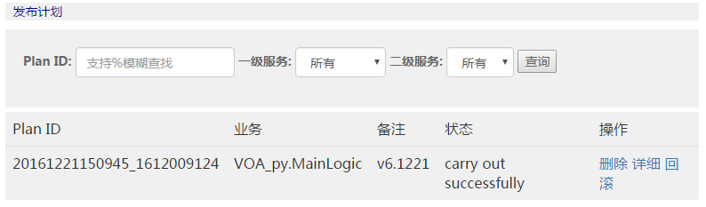

发布成功的话，应该能看到Python扩展MySQL-python被安装，srpc进程启动，四个agent进程也在运行

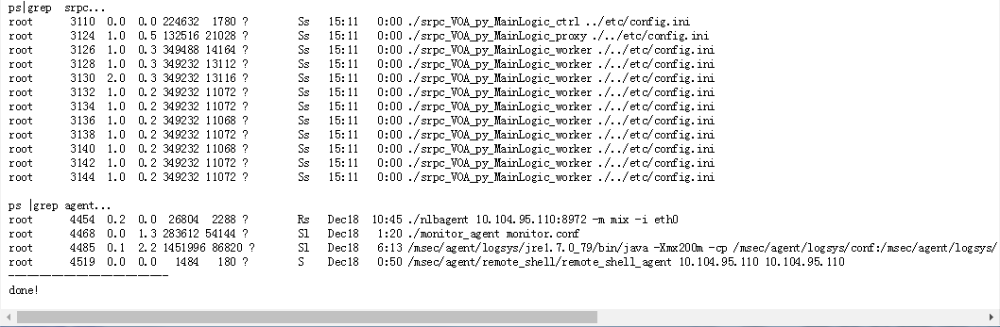

完成发布后，如果业务服务起IP的状态还是disabled，那意味着没有进入负载均衡系统对外服务，这个时候通过菜单“运维->容量”查询并做扩缩容操作，成功后，对应IP状态变为enabled

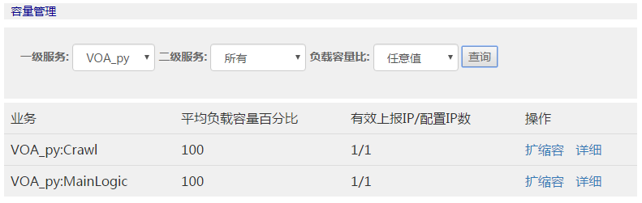

类似的，标准服务Crawl也是如此发布并扩容。

